# AI News Briefing - 11 Collection Agents + Final Merger

This repo runs **11 collection/enrichment agents in parallel**, then a final **Merger Agent** turns the latest outputs into one bilingual AI briefing in English and Hebrew.

The current architecture is:
- **5 core source pipelines**: ADK, Perplexity, RSS, Tavily, Social
- **6 supplemental agents**: Article Reader, Exa, NewsAPI, YouTube, GitHub Trending, xAI Twitter
- **1 final merger**: loads the latest outputs, deduplicates stories, translates to Hebrew, and publishes the combined HTML

**Live site:** [duus0s1bicxag.cloudfront.net](https://duus0s1bicxag.cloudfront.net/) (CloudFront) | [kobyal.github.io/ai-news-briefing](https://kobyal.github.io/ai-news-briefing) (GitHub Pages — raw HTML)

**Suggested GitHub About text:** `11-agent AI news collection + merger pipeline: ADK, Perplexity, RSS, Tavily, Social, Article Reader, Exa, NewsAPI, YouTube, GitHub Trending, xAI Twitter -> bilingual EN/Hebrew briefing + docs/data JSON.`

---

## Quick Start

```bash
python3 -m venv .venv
source .venv/bin/activate

pip install \
  -r adk-news-agent/requirements.txt \
  -r perplexity-news-agent/requirements.txt \
  -r tavily-news-agent/requirements.txt \
  -r social-news-agent/requirements.txt \
  -r merger-agent/requirements.txt \
  -r rss-news-agent/requirements.txt \
  firecrawl-py exa-py newsapi-python

# Run all 11 collection/enrichment agents, then the merger.
python3 run_all.py

# Run only the merger against the latest saved outputs.
python3 run_all.py --merge-only

# Skip selected core pipelines.
python3 run_all.py --skip-adk --skip-social
```

`run_all.py` always launches the supplemental agents. If an API key is missing, those agents usually no-op and continue cleanly.

---

## Architecture

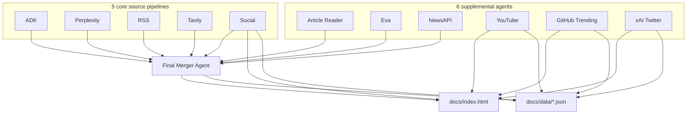

### What feeds the merger vs. what renders separately

| Agent | Used in merger prompt | Rendered directly in merged HTML | Included in `docs/data` |
|------|------------------------|----------------------------------|--------------------------|
| ADK | Yes | No | Through merged briefing |
| Perplexity | Yes | No | Through merged briefing |
| RSS | Yes | No | Through merged briefing |
| Tavily | Yes | No | Through merged briefing |
| Social | Partly | Yes (`people_highlights`, `top_reddit`) | Yes |
| Article Reader | Yes (full-text context) | No | No |
| Exa | Yes | No | Through merged briefing |
| NewsAPI | Yes | No | Through merged briefing |
| YouTube | No | Yes | Yes |
| GitHub Trending | No | Yes | Yes |
| xAI Twitter | No | Yes (`trending_posts`, `people_highlights` merged) | Yes |

---

## Data Flow

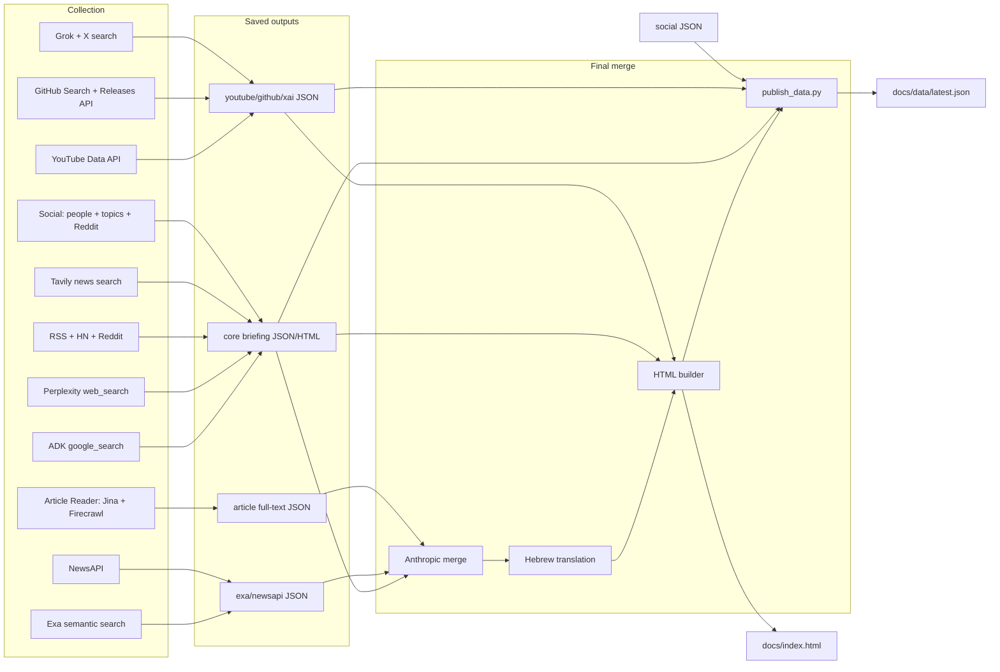

---

## Model Stack

| Agent | Current default models / APIs | Provider |
|------|-------------------------------|----------|
| ADK | `gemini-2.5-flash` + `google_search` | Google AI / ADK |
| Perplexity | `PERPLEXITY_SEARCH_MODEL` default `anthropic/claude-haiku-4-5`, writer `anthropic/claude-sonnet-4-6`, translator `anthropic/claude-haiku-4-5` | Perplexity Responses API |
| RSS | writer `anthropic/claude-haiku-4-5`, translator `anthropic/claude-haiku-4-5` | Perplexity Responses API |
| Tavily | writer `anthropic/claude-sonnet-4-6`, translator `anthropic/claude-haiku-4-5` | Tavily + Perplexity Responses API |
| Social | search `sonar`, writer `anthropic/claude-sonnet-4-6`, translator `anthropic/claude-haiku-4-5` | Perplexity Chat/Responses API |
| Article Reader | no LLM | Jina Reader + Firecrawl |
| Exa | no LLM | Exa API |
| NewsAPI | no LLM | NewsAPI |
| YouTube | no LLM | YouTube Data API v3 |
| GitHub Trending | no LLM | GitHub REST APIs |
| xAI Twitter | `grok-4` via Responses API with `x_search` tool | xAI API |
| Merger | `MERGER_WRITER_MODEL` default `claude-sonnet-4-20250514`, `MERGER_TRANSLATOR_MODEL` default `claude-sonnet-4-20250514` | Anthropic API |

The CI workflow currently sets both merger steps to `claude-sonnet-4-20250514`.

---

## Agents

### 1. ADK News Agent (`adk-news-agent/`)

Google ADK pipeline that uses Gemini and `google_search`, then resolves Google grounding URLs before writing the final briefing.

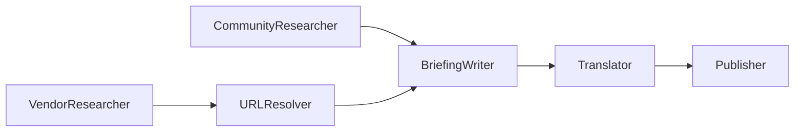

**Run**
```bash
cd adk-news-agent
python3 run.py
```

**Key env**
- `GOOGLE_API_KEY`
- `GOOGLE_GENAI_MODEL` (default `gemini-2.5-flash`)
- `LOOKBACK_DAYS`

### 2. Perplexity News Agent (`perplexity-news-agent/`)

Agentic search pipeline on the Perplexity Responses API. It does vendor research, community research, structured JSON writing, translation, then HTML publishing.

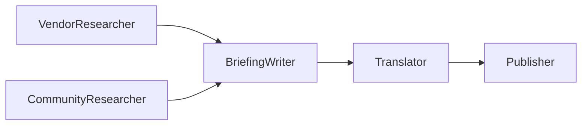

**Run**
```bash
cd perplexity-news-agent
python3 run.py
```

**Key env**
- `PERPLEXITY_API_KEY`
- `PERPLEXITY_SEARCH_MODEL`
- `PERPLEXITY_WRITER_MODEL`
- `PERPLEXITY_TRANSLATOR_MODEL`
- `LOOKBACK_DAYS`

### 3. RSS News Agent (`rss-news-agent/`)

Deterministic fetch pipeline for vendor blogs, tech feeds, Hacker News, and Reddit. No search LLM is used; LLM work only starts at synthesis.

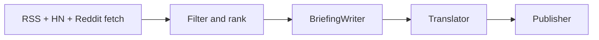

**Run**
```bash
cd rss-news-agent
python3 run.py
```

**Key env**
- `PERPLEXITY_API_KEY`
- `RSS_WRITER_MODEL`
- `RSS_TRANSLATOR_MODEL`
- `LOOKBACK_DAYS`

### 4. Tavily News Agent (`tavily-news-agent/`)

Searches 11 vendors through Tavily, then uses Perplexity-hosted models to turn the fetched articles into briefing JSON and Hebrew output.

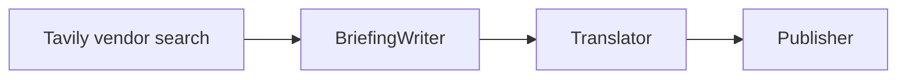

**Run**
```bash
cd tavily-news-agent
python3 run.py
```

**Key env**
- `TAVILY_API_KEY`
- `PERPLEXITY_API_KEY`
- `TAVILY_WRITER_MODEL`
- `TAVILY_TRANSLATOR_MODEL`
- `LOOKBACK_DAYS`

### 5. Social News Agent (`social-news-agent/`)

Tracks the AI conversation layer instead of article publishing:
- `62` tracked people
- `20` topic buckets
- `17` Reddit communities

It uses Perplexity search for people/topics, authenticated Reddit if credentials exist, anonymous Reddit fallback otherwise, and Exa fallback when people/topic coverage is too thin.

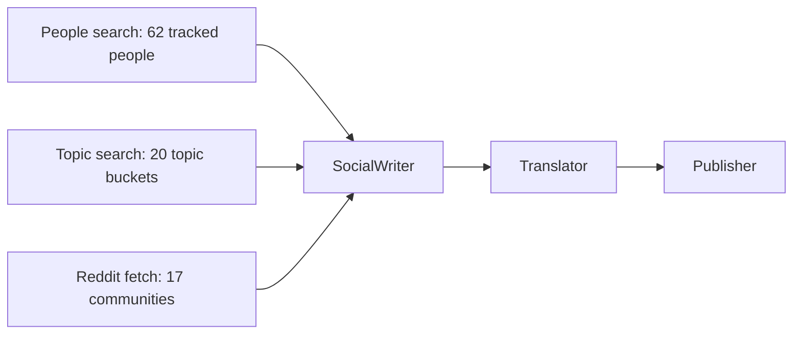

**Run**
```bash
cd social-news-agent
python3 run.py
```

**Key env**
- `PERPLEXITY_API_KEY`
- `SOCIAL_SEARCH_MODEL` (default `sonar`)
- `SOCIAL_WRITER_MODEL`
- `SOCIAL_TRANSLATOR_MODEL`
- `REDDIT_CLIENT_ID`, `REDDIT_CLIENT_SECRET`, `REDDIT_USERNAME`, `REDDIT_PASSWORD` for OAuth mode
- `EXA_API_KEY` for fallback search
- `LOOKBACK_DAYS`

### 6. Article Reader Agent (`article-reader-agent/`)

Collects article URLs from recent core outputs, supplements them with Tavily or DuckDuckGo search, reads full text with Jina Reader, and falls back to Firecrawl when needed.

This agent exists only to improve merger quality; it does not produce newsletter HTML.

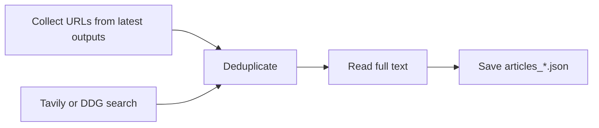

**Run**
```bash
cd article-reader-agent
python3 run.py
```

**Key env**
- `TAVILY_API_KEY` or `TAVILY_API_KEY2`
- `FIRECRAWL_API_KEY` for fallback reader
- `SKIP_ARTICLE_READING=true` to disable
- `ARTICLE_READ_TIMEOUT`

### 7. Exa News Agent (`exa-news-agent/`)

Semantic search layer for niche or technical AI stories that broader web/news search can miss.

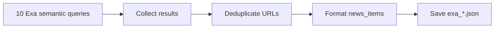

**Run**
```bash
cd exa-news-agent
python3 run.py
```

**Key env**
- `EXA_API_KEY`
- `LOOKBACK_DAYS`

### 8. NewsAPI Agent (`newsapi-agent/`)

Structured news wire layer that prioritizes normalized dates, source metadata, and broad mainstream coverage.

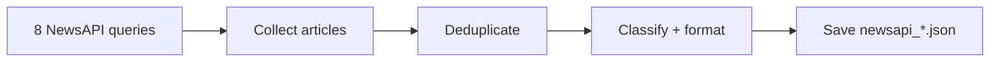

**Run**
```bash
cd newsapi-agent
python3 run.py
```

**Key env**
- `NEWSAPI_KEY`
- `LOOKBACK_DAYS`

### 9. YouTube News Agent (`youtube-news-agent/`)

Video discovery layer that pulls from `26` curated channels, adds `4` targeted searches, fetches stats, filters aggressively, and emits a JSON section for direct rendering in the merged HTML.

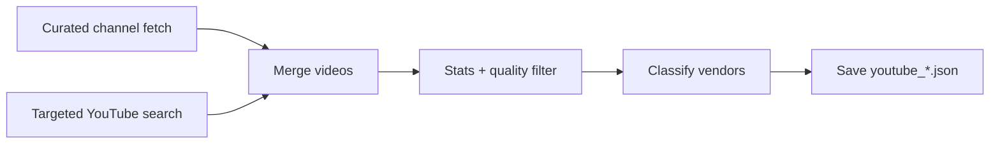

**Run**
```bash
cd youtube-news-agent
python3 run.py
```

**Key env**
- `YOUTUBE_API_KEY` or `GOOGLE_API_KEY`
- `LOOKBACK_DAYS`

### 10. GitHub Trending Agent (`github-trending-agent/`)

Tracks open-source AI momentum through repository search and release polling:
- `6` trending search queries
- `15` tracked repositories for release checks

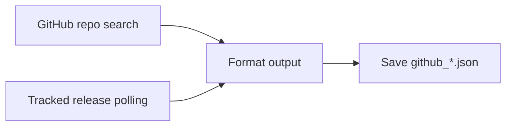

**Run**
```bash
cd github-trending-agent
python3 run.py
```

**Key env**
- `GITHUB_TOKEN` optional for higher rate limits
- `LOOKBACK_DAYS`

### 11. xAI Twitter Agent (`xai-twitter-agent/`)

Uses Grok to look for:
- recent posts from `15` tracked AI leaders
- viral AI posts on X
- AI Twitter community signals

The agent saves JSON output. `publish_data.py` includes it in `docs/data`, the merger renders trending posts as a dedicated section, and xAI people are merged into the "People Talking Today" cards.

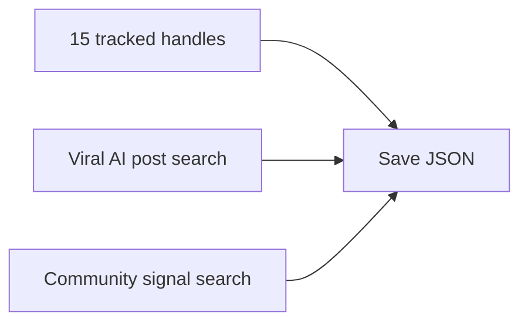

**Run**
```bash
cd xai-twitter-agent
python3 run.py
```

**Key env**
- `XAI_API_KEY`
- `LOOKBACK_DAYS`

### 12. Merger Agent (`merger-agent/`)

Runs **after** the other agents. It loads the latest saved outputs, merges core news, uses Article Reader full-text context, includes Exa and NewsAPI as extra sources, translates to Hebrew with three parallel calls, and renders the final HTML.

Directly rendered sections in the merged page come from:
- Social `people_highlights` (merged with xAI `people_highlights`)
- Social `top_reddit`
- xAI Twitter `trending_posts`
- YouTube `news_items`
- GitHub Trending `news_items`

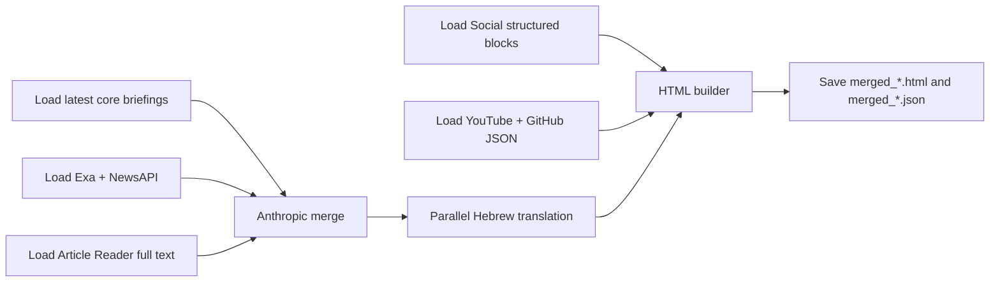

**Run**
```bash
cd merger-agent
python3 run.py
```

**Key env**
- `ANTHROPIC_API_KEY`
- `MERGER_WRITER_MODEL`
- `MERGER_TRANSLATOR_MODEL`

---

## Run Everything

`run_all.py` starts all collection/enrichment agents in parallel and only then runs the merger.

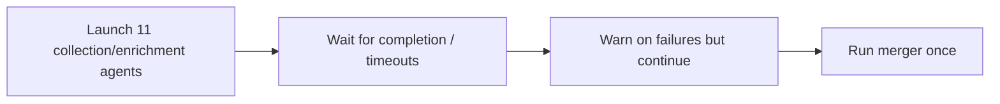

**Commands**
```bash
python3 run_all.py
python3 run_all.py --skip-adk
python3 run_all.py --skip-px --skip-social
python3 run_all.py --merge-only
```

**Useful env**
- `AGENT_TIMEOUT` default `480` seconds for each launched process
- `LOOKBACK_DAYS` default `3`

---

## Why This Architecture

The repo is no longer "five pipelines plus merger". It is a layered collection system:

| Layer | Agents | Purpose |
|------|--------|---------|
| Core news collection | ADK, Perplexity, RSS, Tavily | High-signal vendor and industry news from different retrieval styles |
| Social/community collection | Social | What people are discussing, not just what was published |
| Enrichment | Article Reader | Full article text for better merged summaries |
| Supplemental discovery | Exa, NewsAPI | Niche semantic search plus structured mainstream news coverage |
| Direct-render side channels | YouTube, GitHub Trending | Video and open-source sections that should not be collapsed into headline cards |
| Social side channel | xAI Twitter | X/Twitter trending posts + people highlights, rendered in merged HTML |
| Final synthesis | Merger | Deduplication, ranking, Hebrew translation, HTML publishing |

That split matters because different agents solve different problems:
- ADK and Perplexity are best at live search.
- RSS is deterministic and cheap.
- Tavily is strong for fresh vendor-by-vendor article retrieval.
- Social catches practitioner sentiment and community reaction.
- Article Reader improves summary density by adding full article text.
- Exa and NewsAPI widen recall without changing the core story format.
- YouTube and GitHub are more useful as dedicated sections than as generic news cards.

---

## Outputs

### Per-agent outputs

| Path | Output |
|------|--------|
| `adk-news-agent/output/YYYY-MM-DD/briefing_*.html` | ADK standalone newsletter |
| `adk-news-agent/output/YYYY-MM-DD/briefing_*.json` | ADK structured briefing |
| `perplexity-news-agent/output/YYYY-MM-DD/briefing_*.html` | Perplexity standalone newsletter |
| `perplexity-news-agent/output/YYYY-MM-DD/briefing_*.json` | Perplexity structured briefing |
| `rss-news-agent/output/YYYY-MM-DD/briefing_*.html` | RSS standalone newsletter |
| `rss-news-agent/output/YYYY-MM-DD/briefing_*.json` | RSS structured briefing |
| `tavily-news-agent/output/YYYY-MM-DD/briefing_*.html` | Tavily standalone newsletter |
| `tavily-news-agent/output/YYYY-MM-DD/briefing_*.json` | Tavily structured briefing |
| `social-news-agent/output/YYYY-MM-DD/briefing_*.html` | Social standalone newsletter |
| `social-news-agent/output/YYYY-MM-DD/briefing_*.json` | Social structured briefing |
| `article-reader-agent/output/YYYY-MM-DD/articles_*.json` | Full article text cache for merger context |
| `exa-news-agent/output/YYYY-MM-DD/exa_*.json` | Supplemental news source |
| `newsapi-agent/output/YYYY-MM-DD/newsapi_*.json` | Supplemental news source |
| `youtube-news-agent/output/YYYY-MM-DD/youtube_*.json` | Video section source |
| `github-trending-agent/output/YYYY-MM-DD/github_*.json` | Open-source section source |
| `xai-twitter-agent/output/YYYY-MM-DD/xai_twitter_*.json` | X/Twitter side-channel data |
| `merger-agent/output/YYYY-MM-DD/merged_*.html` | Final merged newsletter |
| `merger-agent/output/YYYY-MM-DD/merged_*.json` | Final merged structured output |

### Published outputs

| Path | Producer | Notes |
|------|----------|-------|
| `docs/index.html` | GitHub Actions | Latest merged newsletter for GitHub Pages |
| `docs/data/YYYY-MM-DD.json` | `publish_data.py` | Combined machine-readable daily snapshot |
| `docs/data/latest.json` | `publish_data.py` | Latest combined snapshot |

`publish_data.py` currently bundles:
- merged briefing
- social briefing
- YouTube items
- GitHub items
- twitter/xAI payload

---

## Automation and Publishing

The daily schedule is driven entirely by EventBridge (no GitHub Actions cron):

| Israel time | UTC | Lambda | Action |
|---|---|---|---|
| 06:00 | 03:00 | `ai-news-trigger` | Dispatches GitHub Actions workflow |
| 07:00 | 04:00 | `ai-news-ingest` | Ingests published data into DynamoDB |
| 15:00 | 12:00 | `ai-news-trigger` | Dispatches GitHub Actions workflow |
| 16:00 | 13:00 | `ai-news-ingest` | Ingests published data into DynamoDB |

The GitHub Actions workflow (`daily_briefing.yml`) only responds to `workflow_dispatch` — no cron. Steps:
1. install dependencies
2. run `python3 run_all.py`
3. copy the latest merged HTML to `docs/index.html`
4. run `python3 publish_data.py`
5. commit and push outputs
6. send email

---

## Environment

| Env var | Used by |
|--------|---------|
| `GOOGLE_API_KEY` | ADK, optionally YouTube |
| `GOOGLE_GENAI_MODEL` | ADK |
| `PERPLEXITY_API_KEY` | Perplexity, RSS, Tavily, Social |
| `PERPLEXITY_SEARCH_MODEL` | Perplexity |
| `PERPLEXITY_WRITER_MODEL` | Perplexity |
| `PERPLEXITY_TRANSLATOR_MODEL` | Perplexity |
| `RSS_WRITER_MODEL` / `RSS_TRANSLATOR_MODEL` | RSS |
| `TAVILY_API_KEY` / `TAVILY_API_KEY2` | Tavily, Article Reader |
| `TAVILY_WRITER_MODEL` / `TAVILY_TRANSLATOR_MODEL` | Tavily |
| `SOCIAL_SEARCH_MODEL` / `SOCIAL_WRITER_MODEL` / `SOCIAL_TRANSLATOR_MODEL` | Social |
| `REDDIT_CLIENT_ID`, `REDDIT_CLIENT_SECRET`, `REDDIT_USERNAME`, `REDDIT_PASSWORD` | Social Reddit OAuth |
| `EXA_API_KEY` | Exa, Social fallback |
| `NEWSAPI_KEY` | NewsAPI |
| `YOUTUBE_API_KEY` | YouTube |
| `GITHUB_TOKEN` | GitHub Trending optional auth |
| `XAI_API_KEY` | xAI Twitter |
| `FIRECRAWL_API_KEY` | Article Reader fallback |
| `ANTHROPIC_API_KEY` | Merger |
| `MERGER_WRITER_MODEL` / `MERGER_TRANSLATOR_MODEL` | Merger |
| `LOOKBACK_DAYS` | Most agents |
| `AGENT_TIMEOUT` | `run_all.py` |
| `SKIP_ARTICLE_READING` | Article Reader |

---

## Vendor Coverage

The merger classifies stories into these vendor buckets:

| Vendor | Focus |
|--------|-------|
| Anthropic | Claude, API, safety, coding tools |
| AWS | Bedrock, Nova, SageMaker |
| OpenAI | GPT, ChatGPT, API, reasoning models |
| Google | Gemini, DeepMind, Gemma |
| Azure | Azure AI, Copilot, Microsoft AI |
| Meta | Llama, Meta AI |
| xAI | Grok, xAI releases |
| NVIDIA | GPUs, inference stack, NIM |
| Mistral | Open and commercial models |
| Apple | Apple Intelligence, on-device AI |
| Hugging Face | Models, datasets, open-source ecosystem |
| Alibaba | Qwen, Tongyi, cloud AI |
| DeepSeek | DeepSeek models, open-source LLMs |
| Samsung | On-device AI, Gauss, hardware AI |

Stories not matching a specific vendor are classified as `Other`.

---

## Web App

The frontend is a **Next.js** static-export app in `web/`. It fetches data from the API at runtime and renders:

| Route | Description |
|-------|-------------|
| `/` | Homepage — TL;DR, stories grid, vendor filter, community/social sections |
| `/stories` | Full story archive with hero + grid layout |
| `/community` | People highlights, Reddit, community pulse |
| `/media` | YouTube, GitHub trending, X/Twitter |
| `/archive` | Calendar view of past briefings |
| `/[date]` | Individual day briefing |

### Local development

```bash
cd web
npm install
npm run dev   # → http://localhost:3000
```

### Build & deploy

```bash
cd web
npm run build                    # generates out/ (static export)
aws s3 sync out s3://ai-news-briefing-web --delete
aws cloudfront create-invalidation --distribution-id E2XOWDA6B84582 --paths "/*"
```

---

## Infrastructure (AWS CDK)

All infrastructure is defined in `infra/` using AWS CDK (Python).

| Stack | Resources |
|-------|-----------|
| `DatabaseStack` | DynamoDB table `ai-news-stories` (PK/SK, GSI on date+vendor) |
| `TriggerStack` | Lambda `ai-news-trigger` — dispatches GitHub Actions workflow via EventBridge cron |
| `IngestStack` | Lambda `ai-news-ingest` — reads from GitHub Pages, writes to DynamoDB. Runs delete-then-write per date |
| `ApiStack` | Lambda `ai-news-api` behind API Gateway — serves `/api/stories`, `/api/archive`, `/api/story/:id` |
| `FrontendStack` | S3 bucket + CloudFront distribution with OAC, API proxy on `/api/*` |

### Deploy CDK

```bash
cd infra
pip install -r requirements.txt
cdk deploy --all
```

### EventBridge schedule (single daily run)

| Israel Time | UTC | Lambda | Purpose |
|-------------|-----|--------|---------|
| 06:00 | 03:00 | `ai-news-trigger` | Kick off GitHub Actions pipeline (budget mode by default) |
| 06:20 | 03:20 | `ai-news-ingest` | Ingest to DynamoDB after pipeline completes |

### GitHub Actions workflow modes

| Mode | What runs | Cost per run |
|------|-----------|-------------|
| `budget` (default) | All agents except xAI | ~$1.44 |
| `all` | Everything including xAI | ~$2.39 |
| `merge-only` | Just the merger | ~$0.10 |
