# AI News Briefing

A daily AI news pipeline. Eleven independent agents collect stories from search APIs, RSS feeds, social channels, and developer sources in parallel; a final Merger Agent deduplicates, ranks, summarizes, and translates them into one bilingual (English + Hebrew) briefing. The output is a static HTML page and a structured JSON file that any frontend can consume.

The pipeline is designed to be **forkable**: every external dependency has a fallback, every paid call has a free alternative, and the merger can run on either the Anthropic API or a Claude Max subscription (zero per-call cost). If you fork this repo and supply your own keys, it should run end-to-end on your own GitHub Actions + GitHub Pages without any other infrastructure.

**Live site:** [duus0s1bicxag.cloudfront.net](https://duus0s1bicxag.cloudfront.net/) (Next.js app on CloudFront — maintainer's deployment)
**Raw merged briefing:** `kobyal.github.io/ai-news-briefing/report/latest.html` (GitHub Pages — what this repo publishes directly)
**Structured data:** `kobyal.github.io/ai-news-briefing/data/<YYYY-MM-DD>.json` (machine-readable daily snapshot)

**Operational docs:**
- [COSTS.md](./COSTS.md) — per-run + month-to-date cost breakdown, dashboard refresh recipe
- [FALLBACKS.md](./FALLBACKS.md) — every rotation path per service, tracker contract

---

## Quick Start

```bash
# 1. Clone and create a virtualenv
git clone https://github.com/kobyal/ai-news-briefing
cd ai-news-briefing
python3 -m venv .venv
source .venv/bin/activate

# 2. Install per-agent requirements (one file at a time — see "Why per-file?" below)
for req in adk-news-agent perplexity-news-agent tavily-news-agent \
           rss-news-agent merger-agent twitter-agent; do
  pip install -r "${req}/requirements.txt"
done
pip install firecrawl-py exa-py newsapi-python duckduckgo-search

# 3. Provide API keys (.env at repo root, or export in shell)
cp .env.example .env  # fill in the keys you have; missing keys make agents no-op cleanly

# 4. Run everything: 10 collectors in parallel, then the merger.
python3 run_all.py

# Useful flags:
python3 run_all.py --list                    # show all agents + cost tier
python3 run_all.py --merge-only              # re-run only merger against latest outputs
python3 run_all.py --skip xai twitter        # skip selected agents
python3 run_all.py --only adk perplexity     # run ONLY these (+ merger)
python3 run_all.py --free-only               # skip all paid APIs
```

**Why per-file pip install?** `pip install -r a -r b -r c` is atomic — one missing dep (e.g. a `git+https` URL momentarily 404s) rolls back the entire batch and silently skips packages from earlier files. Splitting per-file means a flaky dep takes down only its own agent. CI does the same.

If a required key is missing, the agent prints a warning and writes an empty/partial output. The merger handles missing inputs gracefully.

---

## Architecture

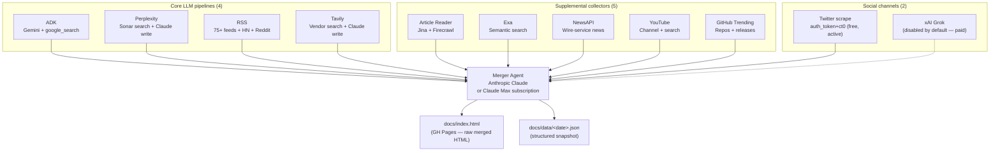

**Three layers, intentionally split:**

| Layer | Why it exists |
|-------|---------------|
| Core LLM pipelines | Each retrieves news from a *different* surface (live web search, vendor blog feeds, semantic search). Running them in parallel means no single provider outage breaks the briefing. |
| Supplemental collectors | Widen recall (Exa for niche AI research; NewsAPI for mainstream coverage), enrich content (Article Reader pulls full body text into merger context), or feed dedicated UI sections (YouTube videos, GitHub repos). |
| Social channels | People-quote and trending-post sections. Twitter scraper covers this for free; xAI Grok is wired in but disabled (cost ≈ $0.35/run, no quality lift over the scraper). |

---

## Data Flow

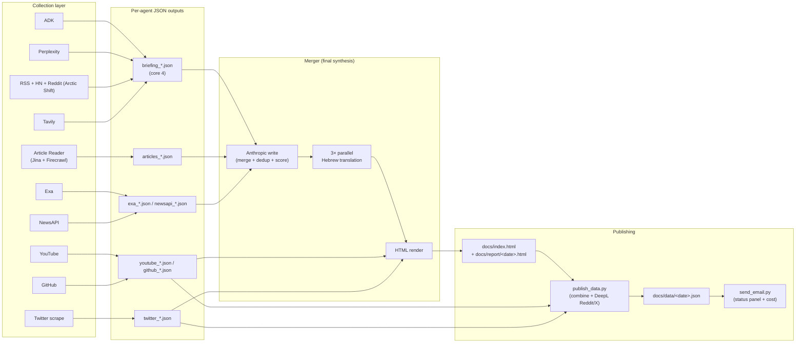

**What feeds the merger prompt vs. what renders directly:**

| Agent | In merger prompt | Rendered directly | In `docs/data` |
|-------|:----------------:|:-----------------:|:--------------:|
| ADK | ✓ | — | via merged briefing |
| Perplexity | ✓ | — | via merged briefing |
| RSS (incl. Reddit + HN) | ✓ | Reddit posts rendered separately | ✓ |
| Tavily | ✓ | — | via merged briefing |
| Article Reader | ✓ (full-text context) | — | — |
| Exa | ✓ | — | via merged briefing |
| NewsAPI | ✓ | — | via merged briefing |
| YouTube | — | ✓ (video grid) | ✓ |
| GitHub Trending | — | ✓ (repo cards) | ✓ |
| Twitter scrape | — | ✓ (people + trending) | ✓ |
| xAI Grok | — | ✓ (when enabled — fallback for Twitter) | ✓ |

---

## Two ways to run the merger

The merger can talk to Claude in two ways. Pick whichever matches your account.

### A. Anthropic API (default)

Set `ANTHROPIC_API_KEY` in your environment and run normally. Cost ≈ **$0.76/run** for the merger (Sonnet 4.6 input + 3 parallel translations) plus collector LLMs ≈ $0.25 → **~$1.01/run total**. See [COSTS.md](./COSTS.md) for the measured breakdown.

### B. Claude Max subscription (zero per-call cost)

If you have a Claude Max account, the merger can route Anthropic calls through `claude -p` (the Claude Code CLI), which uses your OAuth keychain credentials instead of a metered API key. **Sonnet 4.6 → Opus 4.7 included, $0 marginal cost per run.**

**Switch:**
```bash
unset ANTHROPIC_API_KEY        # hard-block the API path
export MERGER_VIA_CLAUDE_CODE=1 # route via `claude -p`
python3 run_all.py --skip xai
```

The flag is honored by the four LLM-using agents (`merger-agent`, `perplexity-news-agent`, `rss-news-agent`, `tavily-news-agent`) via `shared/anthropic_cc.py`. On success, the merger writes a marker file `merger-agent/output/<date>/.via_subscription.done`; if CI sees that marker dated within 5 hours, it skips the daily run so you don't double-bill.

The maintainer wraps this whole flow (subscription run → publish → email → AWS Lambda ingest) in `private/LOCAL_RUN.md` (gitignored). For a fork, the three lines above are enough — wire the rest to your own publish target.

### C. Re-running just the merger

If you've already collected today's data and only want to re-render with a different model or prompt:
```bash
python3 run_all.py --merge-only
```
Loads the latest per-agent outputs from disk. Free for collectors, only the merger LLM cost.

---

## Per-agent reference

Each agent is independent: separate folder, requirements, run.py, output dir. Agents follow the convention `<name>-news-agent/<name>_news_agent/`. Skip any with `--skip <name>`.

### 1. ADK News Agent — `adk-news-agent/`

Google Agent Development Kit pipeline. Vendor + community researchers use Gemini with `google_search`, then a URL resolver expands Google grounding redirects, then writer + translator + publisher.

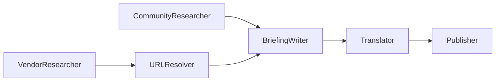

**Run:** `cd adk-news-agent && python3 run.py`
**Env:** `GOOGLE_API_KEY`, `GOOGLE_GENAI_MODEL` (default `gemini-2.5-flash`), `LOOKBACK_DAYS`

### 2. Perplexity News Agent — `perplexity-news-agent/`

Perplexity Sonar for search; writer + translator now call **Anthropic SDK directly** (cost-saving routing change, 2026-04-23). Sonar still does the actual web research.

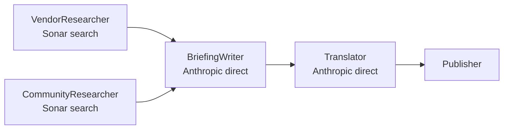

**Run:** `cd perplexity-news-agent && python3 run.py`
**Env:** `PERPLEXITY_API_KEY`, `ANTHROPIC_API_KEY`, `PERPLEXITY_SEARCH_MODEL`, `PERPLEXITY_WRITER_MODEL`, `PERPLEXITY_TRANSLATOR_MODEL`, `LOOKBACK_DAYS`

### 3. RSS News Agent — `rss-news-agent/`

Deterministic fetch — no search LLM. Pulls from 75+ vendor blogs, tech feeds, Hacker News, and Reddit (via [Arctic Shift](https://github.com/ArthurHeitmann/arctic_shift), no auth required). LLM only enters at synthesis.

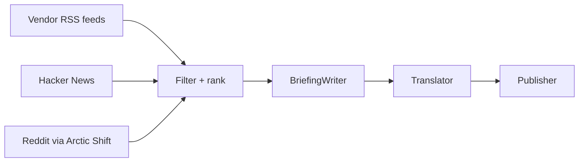

**Run:** `cd rss-news-agent && python3 run.py`
**Env:** `ANTHROPIC_API_KEY`, `RSS_WRITER_MODEL`, `RSS_TRANSLATOR_MODEL`, `LOOKBACK_DAYS`
**Note:** Reddit posts (filtered to score ≥ 20) are also surfaced separately on the live site via `publish_data.py` + DeepL translation.

### 4. Tavily News Agent — `tavily-news-agent/`

Hits 11 vendor topics through Tavily Search, then Anthropic Haiku writes + translates. Tavily key chain: `TAVILY_API_KEY → KEY2 → KEY3 → DuckDuckGo`.

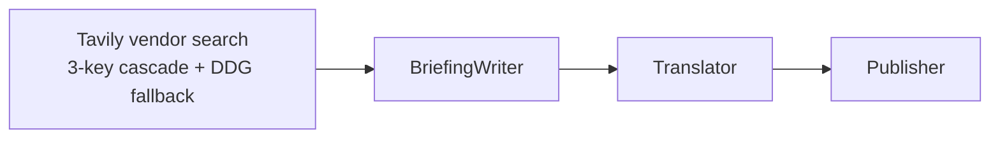

**Run:** `cd tavily-news-agent && python3 run.py`
**Env:** `TAVILY_API_KEY` (+ `TAVILY_API_KEY2`, `TAVILY_API_KEY3`), `ANTHROPIC_API_KEY`, `TAVILY_WRITER_MODEL`, `TAVILY_TRANSLATOR_MODEL`, `LOOKBACK_DAYS`

### 5. Article Reader Agent — `article-reader-agent/`

Enrichment-only — no newsletter HTML. Collects URLs from the four core agents' outputs, optionally widens with Tavily/DDG search, fetches full body text via Jina Reader (then Firecrawl, then local cache).

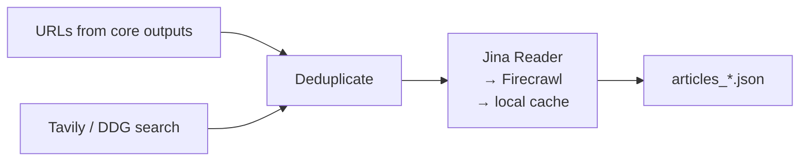

**Run:** `cd article-reader-agent && python3 run.py`
**Env:** `JINA_API_KEY` (+ `JINA_API_KEY2`), `FIRECRAWL_API_KEY`, `TAVILY_API_KEY`, `SKIP_ARTICLE_READING=true` to disable, `ARTICLE_READ_TIMEOUT`

### 6. Exa News Agent — `exa-news-agent/`

Semantic search for niche/technical AI stories that broad search misses. 10 hand-tuned queries.

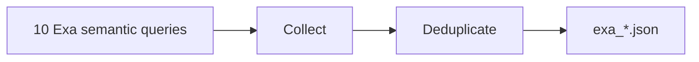

**Run:** `cd exa-news-agent && python3 run.py`
**Env:** `EXA_API_KEY` (+ `EXA_API_KEY2`), `LOOKBACK_DAYS`

### 7. NewsAPI Agent — `newsapi-agent/`

Structured wire-service feed for mainstream coverage. 8 queries, vendor classification, dedup.

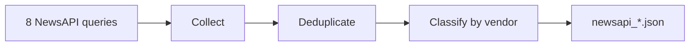

**Run:** `cd newsapi-agent && python3 run.py`
**Env:** `NEWSAPI_KEY` (+ `NEWSAPI_KEY2`), `LOOKBACK_DAYS`

### 8. YouTube News Agent — `youtube-news-agent/`

Video discovery: ~25 curated channels (Hebrew + vendor) + 4 targeted searches, stats, quality filter, vendor classify. Renders directly in the merged HTML's video section. 7-day lookback (independent of core 3-day default).

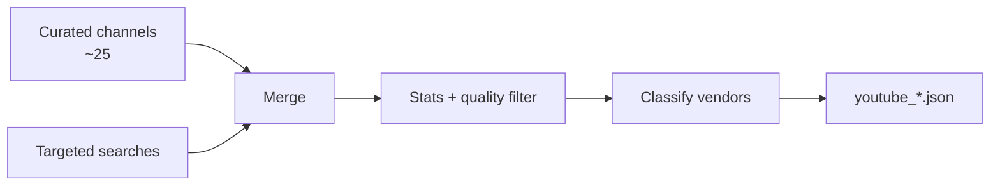

**Run:** `cd youtube-news-agent && python3 run.py`
**Env:** `YOUTUBE_API_KEY` (or `GOOGLE_API_KEY` as fallback), `LOOKBACK_DAYS`

### 9. GitHub Trending Agent — `github-trending-agent/`

Open-source AI momentum: 6 trending search queries + 15 tracked repos for release polling. No LLM.

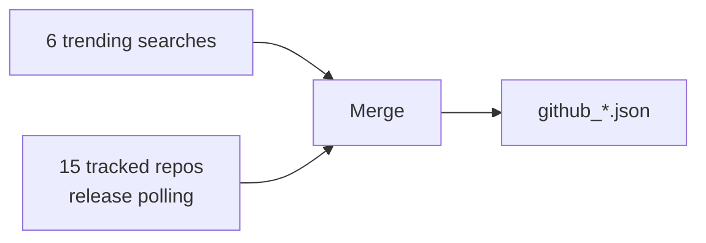

**Run:** `cd github-trending-agent && python3 run.py`
**Env:** `GITHUB_TOKEN` (optional — for higher rate limits), `LOOKBACK_DAYS`

### 10. Twitter Agent — `twitter-agent/` (active, free)

Direct X/Twitter GraphQL scrape using a logged-in session's `auth_token` + `ct0` cookies — no paid API. Pulls recent posts from a curated list of AI leaders (Sam Altman, Yann LeCun, Greg Brockman, François Chollet, Simon Willison, etc.) plus a trending AI search. Output schema matches the xAI agent so the merger and frontend treat them interchangeably.

**Reliability:** People-timeline path is stable. Search/trending path occasionally 404s when X rotates GraphQL query IDs (last fixed 2026-04-27). When this breaks, the merger shows trending=empty rather than failing.

**Run:** `cd twitter-agent && python3 run.py`
**Env:** `TWITTER_AUTH_TOKEN`, `TWITTER_CT0` (cookies — see [How to get them](#how-to-get-twitter-cookies)), `LOOKBACK_DAYS`

### 11. xAI Twitter Agent — `xai-twitter-agent/` (disabled by default)

Same role as `twitter-agent` but uses Grok-4 + xAI's `x_search` tool instead of scraping. Disabled in CI (`--skip xai`) because it costs ≈ $0.35/run with no quality advantage over the free scraper. Re-enable by removing `--skip xai` if X cookies become unobtainable.

**Run:** `cd xai-twitter-agent && python3 run.py`
**Env:** `XAI_API_KEY`, `LOOKBACK_DAYS`

### 12. Merger Agent — `merger-agent/`

Final synthesis. Loads the latest of every per-agent JSON output, runs them through Claude (one merge call + three parallel translation calls), and renders the bilingual HTML.

```mermaid
flowchart LR
    A[Load core 4 briefings] --> M[Merge call<br/>(Claude Sonnet 4.6<br/>or Opus 4.7 sub)]
    B[Load Article Reader<br/>full text] --> M
    C[Load Exa + NewsAPI] --> M
    M --> T[3× parallel<br/>Hebrew translation]

    T --> H[HTML builder]
    D[Twitter / xAI<br/>people + trending] --> H
    E[YouTube + GitHub] --> H

    H --> O[merged_*.html<br/>+ merged_*.json]
```

**Run:** `cd merger-agent && python3 run.py`
**Env:**
- `ANTHROPIC_API_KEY` *or* `MERGER_VIA_CLAUDE_CODE=1` (subscription path — see above)
- `MERGER_WRITER_MODEL` (default `claude-sonnet-4-6` on API path)
- `MERGER_TRANSLATOR_MODEL` (default `claude-sonnet-4-6`)
- `MERGER_CC_MODEL` (default `claude-opus-4-7`, subscription only)
- `MERGER_CC_EFFORT` (default `low`, subscription only — keeps output under the 32K single-turn ceiling so Claude Code doesn't auto-continue and break JSON parsing)

---

## Model Stack

| Agent | API path default | Subscription path | Provider |
|-------|------------------|-------------------|----------|
| ADK | `gemini-2.5-flash` + `google_search` | (n/a — not Anthropic) | Google AI |
| Perplexity | search: Sonar; writer + translator: `claude-haiku-4-5` (direct) | writer + translator → Opus 4.7 via `claude -p` | Perplexity + Anthropic |
| RSS | writer + translator: `claude-haiku-4-5` | → Opus 4.7 via `claude -p` | Anthropic |
| Tavily | writer + translator: `claude-haiku-4-5` | → Opus 4.7 via `claude -p` | Tavily + Anthropic |
| Article Reader | (no LLM) | (n/a) | Jina + Firecrawl |
| Exa | (no LLM) | (n/a) | Exa |
| NewsAPI | (no LLM) | (n/a) | NewsAPI |
| YouTube | (no LLM) | (n/a) | YouTube Data API v3 |
| GitHub Trending | (no LLM) | (n/a) | GitHub REST |
| Twitter | (no LLM) | (n/a) | X GraphQL (scrape) |
| xAI | `grok-4` + `x_search` | (not routed) | xAI |
| **Merger** | writer + translator: `claude-sonnet-4-6` | `claude-opus-4-7` via `claude -p` | Anthropic |

---

## Outputs

### Per-agent (committed daily)

| Path | Description |
|------|-------------|
| `<agent>/output/<YYYY-MM-DD>/briefing_<HHMMSS>.{html,json}` | Standalone briefing per core agent |
| `<agent>/output/<YYYY-MM-DD>/usage_<HHMMSS>.json` | Per-call token + cost log (LLM agents only) |
| `article-reader-agent/output/.../articles_*.json` | Full article body text for merger context |
| `exa-news-agent/output/.../exa_*.json` | Supplemental sources |
| `newsapi-agent/output/.../newsapi_*.json` | Supplemental sources |
| `youtube-news-agent/output/.../youtube_*.json` | Direct-render video items |
| `github-trending-agent/output/.../github_*.json` | Direct-render repo items |
| `twitter-agent/output/.../briefing_*.json` | People highlights + trending posts |
| `merger-agent/output/.../merged_*.{html,json}` | Final merged briefing |
| `merger-agent/output/.../.via_subscription.done` | Marker — written when subscription path was used; signals CI to skip |

### Published (the public contract)

| Path | Producer | Notes |
|------|----------|-------|
| `docs/index.html` | CI / `local-cycle.sh` | Latest merged briefing — standalone, no JS dependency |
| `docs/report/<YYYY-MM-DD>.html` | CI / `local-cycle.sh` | Per-day archive |
| `docs/report/latest.html` | CI / `local-cycle.sh` | Alias for today |
| `docs/data/<YYYY-MM-DD>.json` | `publish_data.py` | Combined daily snapshot — see schema below |
| `docs/data/latest.json` | `publish_data.py` | Alias for today |
| `docs/data/_fallbacks_<date>.jsonl` | `shared/fallback_tracker` | One JSON line per key rotation that fired |

### `docs/data/<date>.json` shape

```json
{
  "date": "2026-04-28",
  "briefing": { "tldr": "...", "stories": [...], "tldr_he": "...", "stories_he": [...] },
  "twitter":  { "people_highlights": [...], "trending_posts": [...], "community_pulse": "..." },
  "social":   { "people_highlights": [...], "community_pulse": "...", "top_reddit": [...] },
  "youtube":  [ { "title": ..., "url": ..., "channel": ..., ... } ],
  "github":   [ { "repo": ..., "url": ..., "stars_today": ..., ... } ]
}
```

The site at `kobyal.github.io/ai-news-briefing/data/<date>.json` is the maintainer's deployment of this contract — fork-friendly because the same file is what your fork would publish.

---

## Scheduling & CI

### GitHub Actions (`.github/workflows/daily_briefing.yml`)

Triggered by **`workflow_dispatch` only** — no cron is currently active in the workflow file. The pipeline runs end-to-end (~18 minutes) and commits outputs back to `main` (which deploys GitHub Pages).

**Skip-window** (added 2026-04-24): step 1 checks for `merger-agent/output/<today>/.via_subscription.done`. If the marker is < 5 hours old, every subsequent step short-circuits with `if: steps.skip_check.outputs.skip != 'true'`. This lets the maintainer run via subscription locally (zero cost) and have CI gracefully no-op the same morning.

**Modes** (via workflow_dispatch input):
| Mode | What runs |
|------|-----------|
| `all` (default) | Every agent except xAI, then merger |
| `merge-only` | Only the merger against the latest committed outputs |

### EventBridge (currently disabled)

The maintainer's AWS account has two EventBridge rules wired to drive a daily run:

| Israel Time | UTC | Lambda | Purpose |
|-------------|-----|--------|---------|
| 09:00 | 06:00 | `ai-news-trigger` | Dispatches the GitHub Actions workflow |
| 09:30 | 06:30 | `ai-news-ingest` | Reads `docs/data/<date>.json` from GH Pages → DynamoDB → CloudFront |

**Both rules are disabled as of 2026-04-26** to avoid double-runs while the maintainer was iterating locally. Re-enable with:
```bash
aws events enable-rule --name ai-news-trigger-daily --region us-east-1
aws events enable-rule --name ai-news-ingest-daily --region us-east-1
```

For a fork, you don't need EventBridge at all — uncomment a `cron` trigger in `daily_briefing.yml` and you have a fully self-contained daily pipeline.

---

## Local daily wrapper (subscription-path power user)

The maintainer runs the daily pipeline locally on a Claude Max subscription via a wrapper script `local-cycle.sh` (gitignored — personal runner). The script chains: install deps → `python3 run_all.py --skip xai` (subscription path) → copy HTML to `docs/` → `publish_data.py` → `send_email.py` → git push → wait for GH Pages → invoke AWS ingest Lambda.

If you have a Claude Max account and want to do the same, the **full operational playbook** (env layout, marker semantics, recovery commands, common gotchas) lives in **`private/LOCAL_RUN.md`** (also gitignored — copy out of the maintainer's repo if you have access, or write your own from the recipe in [Two ways to run the merger → B](#b-claude-max-subscription-zero-per-call-cost) above).

Minimum viable local run, no AWS, no email:
```bash
cp .env.example private/.env
vim private/.env                    # fill in keys
set -a; source private/.env; set +a
unset ANTHROPIC_API_KEY
export MERGER_VIA_CLAUDE_CODE=1
python3 run_all.py --skip xai
DATE=$(date +%Y-%m-%d)
cp $(ls -t merger-agent/output/${DATE}/merged_*.html | head -1) docs/index.html
python3 publish_data.py
git add -f docs/ && git commit -m "briefing: ${DATE}" && git push
```

---

## Frontend & Infrastructure (separate repos)

The maintainer's deployment has two extra components that are **not in this public repo**:

- **`web/`** — Next.js static-export site, deployed to S3 + CloudFront. Reads `docs/data/<date>.json` (or its mirrored copy in DynamoDB via `/api/stories`) and renders `/`, `/community/`, `/media/`, `/archive/`, `/[date]/`, `/story?id=...`. Local dev: `cd web && npm install && npm run dev`. Build/deploy: `npm run build && aws s3 sync out s3://<bucket> --delete --exclude "data/*"` (the `data/*` exclude is critical — that folder is written by the ingest Lambda and would be wiped by `--delete`).
- **`infra/`** — AWS CDK (Python). Five stacks: `DatabaseStack` (DynamoDB), `TriggerStack` (Lambda → GH Actions dispatch), `IngestStack` (Lambda → DynamoDB), `ApiStack` (Lambda + API Gateway → `/api/stories`, `/api/archive`, `/api/story/:id`), `FrontendStack` (S3 + CloudFront with OAC).

**Both directories are gitignored from this repo by design** — they exist only in the maintainer's local checkout as separate git repos with no remote. For a fork, you have two clean choices:
1. **Stop at `docs/`** — GitHub Pages serves the merged briefing and the daily JSON. That's a complete product.
2. **Build your own consumer** — your own Next.js/Astro/static frontend that reads the JSON. The schema above is the contract; you don't need DynamoDB or any AWS.

---

## Forking & customizing

Common changes a fork might want:

| Goal | Where |
|------|-------|
| Drop an agent | `python3 run_all.py --skip <name>` or remove its block from the workflow |
| Add an agent | Create `<name>-news-agent/` (mirror an existing one), register in `run_all.py::AGENTS`, add `<name>_*.json` discovery to `merger-agent/merger_agent/pipeline.py` if it should feed the merge prompt, or to `publish_data.py` if it renders directly |
| Change the merger model | `MERGER_WRITER_MODEL=claude-haiku-4-5` (saves ~$0.50/run, some quality drop) |
| Change vendor coverage | `shared/vendors.py` — taxonomy used by all classifiers |
| Change YouTube channel list | `youtube-news-agent/youtube_news_agent/pipeline.py::AI_CHANNELS` |
| Change RSS feed list | `rss-news-agent/rss_news_agent/feeds.py` |
| Disable Hebrew | Skip the translator step or set `MERGER_TRANSLATOR_MODEL=` empty (results in EN-only output) |

---

## Vendor coverage

The merger classifies stories into these vendor buckets. Edit `shared/vendors.py` to change.

| Vendor | Focus |
|--------|-------|
| Anthropic | Claude, API, safety, coding tools |
| OpenAI | GPT, ChatGPT, API, reasoning models |
| Google | Gemini, DeepMind, Gemma |
| Microsoft / Azure | Azure AI, Copilot, Microsoft AI |
| AWS | Bedrock, Nova, SageMaker |
| Meta | Llama, Meta AI |
| xAI | Grok, xAI releases |
| NVIDIA | GPUs, inference stack, NIM |
| Mistral | Open + commercial models |
| Apple | Apple Intelligence, on-device AI |
| Hugging Face | Models, datasets, OS ecosystem |
| Alibaba | Qwen, Tongyi, cloud AI |
| DeepSeek | DeepSeek models, OS LLMs |
| Samsung | On-device AI, Gauss, hardware AI |

Stories not matching a specific vendor are classified as `Other`.

---

## Environment variables

| Var | Used by |
|-----|---------|
| `GOOGLE_API_KEY` | ADK, YouTube fallback |
| `GOOGLE_GENAI_MODEL` | ADK |
| `PERPLEXITY_API_KEY` | Perplexity (Sonar) |
| `PERPLEXITY_SEARCH_MODEL` / `_WRITER_MODEL` / `_TRANSLATOR_MODEL` | Perplexity |
| `ANTHROPIC_API_KEY` | Merger, RSS, Tavily, Perplexity (writer + translator after Apr 23 routing change) |
| `MERGER_VIA_CLAUDE_CODE` | Switch all Anthropic calls to `claude -p` (subscription path) |
| `MERGER_WRITER_MODEL` / `MERGER_TRANSLATOR_MODEL` | Merger (API path) |
| `MERGER_CC_MODEL` / `MERGER_CC_EFFORT` | Merger (subscription path) |
| `RSS_WRITER_MODEL` / `RSS_TRANSLATOR_MODEL` | RSS |
| `TAVILY_API_KEY` (+ `TAVILY_API_KEY2`, `TAVILY_API_KEY3`) | Tavily, Article Reader search |
| `TAVILY_WRITER_MODEL` / `TAVILY_TRANSLATOR_MODEL` | Tavily |
| `EXA_API_KEY` (+ `EXA_API_KEY2`) | Exa |
| `NEWSAPI_KEY` (+ `NEWSAPI_KEY2`) | NewsAPI |
| `YOUTUBE_API_KEY` | YouTube |
| `GITHUB_TOKEN` | GitHub Trending (optional) |
| `XAI_API_KEY` | xAI Grok agent |
| `JINA_API_KEY` (+ `JINA_API_KEY2`) | Article Reader |
| `FIRECRAWL_API_KEY` | Article Reader fallback |
| `TWITTER_AUTH_TOKEN` / `TWITTER_CT0` | Twitter scrape (cookies from logged-in x.com) |
| `DEEPL_API_KEY` | `publish_data.py` (Hebrew for Reddit + X posts) |
| `LOOKBACK_DAYS` | Most agents (default 3) |
| `AGENT_TIMEOUT` | `run_all.py` (default 480 s per process) |
| `SKIP_ARTICLE_READING` | Article Reader |
| `GMAIL_APP_PASSWORD` | `send_email.py` |
| `DASHBOARD_MTD_JSON` | `send_email.py` (CI only — mirrors `private/dashboard_mtd.json`) |

---

## How to get Twitter cookies

1. Open `x.com` in a logged-in browser session.
2. DevTools → Application → Cookies → `https://x.com`.
3. Copy the values of `auth_token` and `ct0`.
4. Paste into `TWITTER_AUTH_TOKEN` and `TWITTER_CT0` env vars.

Cookies expire when X invalidates the session (re-login, password change, suspicious-activity flag). The agent will start returning empty results — re-grab the cookies.

---

## Operational features (added April 2026)

- **Per-run cost tracking** — every LLM-using agent appends each call to a usage log and writes `usage_<HHMMSS>.json` to its output dir. Multi-run days preserve every run's data separately.
- **Fallback tracker** — `shared/fallback_tracker.py` writes one JSON line per key rotation to `/tmp/_fallbacks.jsonl`, persisted to `docs/data/_fallbacks_<date>.jsonl` after the run. The daily email surfaces aggregated counts in a `FALLBACKS FIRED` panel.
- **Three-layer URL defense** — (a) merger system prompt forbids inventing URLs, (b) `merger-agent/pipeline.py` drops any URL not present in source briefings, (c) `publish_data.py` drops URLs whose page title shares zero keywords with the story headline. Prevents cross-story URL mis-assignment.
- **Data-quality audit** — `publish_data.py::_audit_data_quality()` flags EN/HE-translation mismatches, zero-URL stories, and orphan items; the email's `PROBLEMS` banner surfaces them daily so silent regressions can't hide.
- **Image fallback** — `shared/image_fallback.py` covers vendor-logo / OG-image / GitHub-org-logo paths with a denylist for generic-looking org pages (universities, big-firm GH orgs).
- **Dashboard MTD** — `private/dashboard_mtd.json` (gitignored, mirrored to GH secret `DASHBOARD_MTD_JSON`) carries the month-to-date numbers from each provider dashboard. Email displays alongside live today/7-day totals computed from the per-agent usage logs.

---

## License & forking notes

Public-repo contents (this repo): the agents, orchestration, `publish_data.py`, `send_email.py`, GitHub Actions workflows. **Use freely.** No license file yet — treat as MIT for non-commercial use; open an issue if you need an explicit license.

Not in the public repo: the maintainer's `web/` (Next.js frontend), `infra/` (AWS CDK), and `private/` (env + dashboard JSON + local playbooks). Build your own.

If you fork: the only mandatory keys for an end-to-end run are `ANTHROPIC_API_KEY` (or `MERGER_VIA_CLAUDE_CODE=1`) + at least one of `GOOGLE_API_KEY` / `PERPLEXITY_API_KEY` / `TAVILY_API_KEY`. Everything else degrades gracefully.
