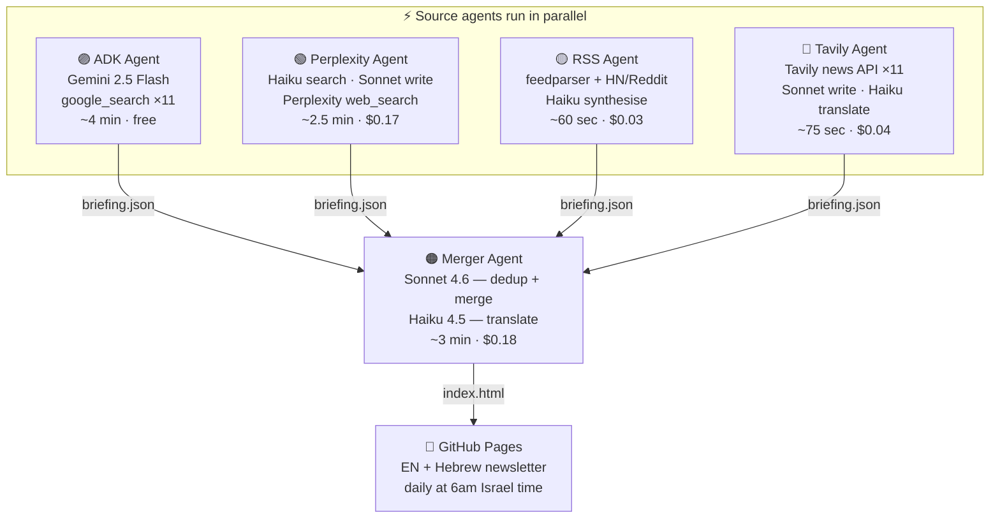
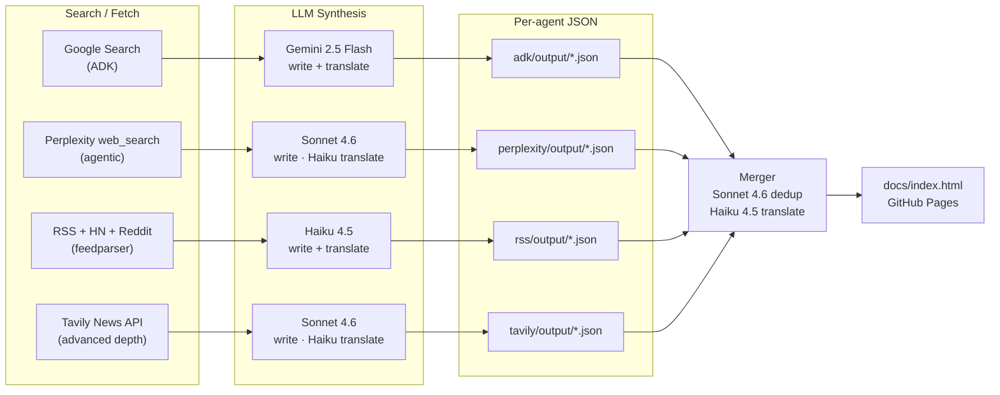
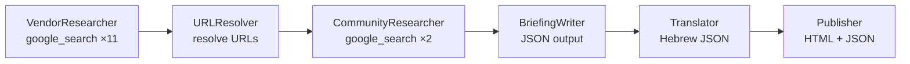
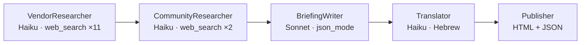
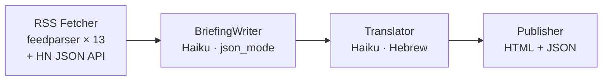
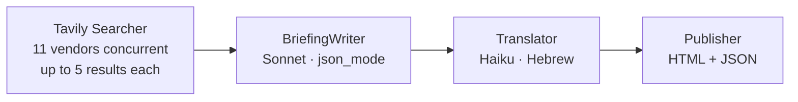
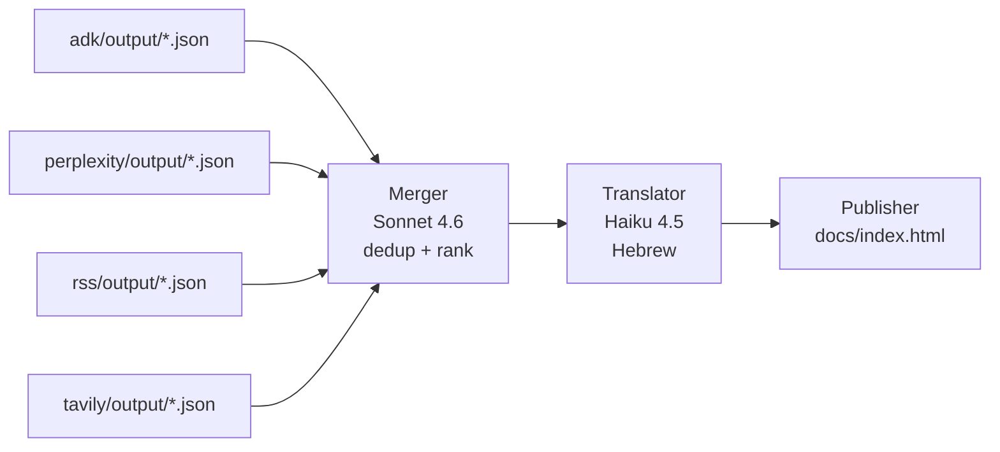

# AI News Briefing — 5-Pipeline Multi-Source Architecture

Four independent AI agents gather today's AI industry news in **parallel**, each using a different search mechanism. A fifth **merger agent** deduplicates and combines all outputs into one definitive bilingual (EN/Hebrew) newsletter published to GitHub Pages.

**Live output:** [kobyal.github.io/ai-news-briefing](https://kobyal.github.io/ai-news-briefing)

---

## Architecture



---

## Data Flow



---

## LLM Stack

| Pipeline | Step | Model | Provider | Why |
|----------|------|-------|----------|-----|
| **Perplexity** | Search ×11 vendors | Claude Haiku 4.5 | Perplexity Agent API | Cheap + fast for many parallel searches |
| **Perplexity** | Write + translate | Claude Sonnet 4.6 | Perplexity Agent API | Best quality for final synthesis |
| **RSS** | Write + translate | Claude Haiku 4.5 | Perplexity Agent API | Data already structured; Haiku sufficient |
| **Tavily** | Write | Claude Sonnet 4.6 | Perplexity Agent API | Sonnet for best synthesis quality |
| **Tavily** | Translate | Claude Haiku 4.5 | Perplexity Agent API | Translation is mechanical; Haiku handles Hebrew well |
| **ADK** | All steps | Gemini 2.5 Flash | Google AI | ADK is Google-native; built-in `google_search` |
| **Merger** | Dedup + merge | Claude Sonnet 4.6 | Perplexity Agent API | Strongest reasoning to merge 4 sources correctly |
| **Merger** | Hebrew translation | Claude Haiku 4.5 | Perplexity Agent API | Translation is mechanical; lower cost |

**Cost per full run:** ~$0.17 + ~$0.03 + ~$0.04 + ~$0.18 ≈ **~$0.42 total** (ADK is free)
**Time per full run:** ~4 min wall clock (agents run in parallel, merger ~3 min after)

---

## Pipelines

### 1. ADK News Agent (`adk-news-agent/`) — ADK + Gemini

**Framework:** Google Agent Development Kit (ADK)
**Model:** Gemini 2.5 Flash (all steps, via `google_search` built-in tool)
**Cost:** ~$0.00 (Gemini free tier) | **Time:** ~4 min



**Run:**
```bash
cd adk-news-agent
adk web           # browser UI at localhost:8000
```

**Automated:** GitHub Actions at 6am Israel time (3am UTC).

> **Note:** `adk run` headless mode exits before Publisher completes. Use `adk web` for reliable full runs.

---

### 2. Perplexity News Agent (`perplexity-news-agent/`)

**Framework:** None — pure Python, direct HTTP to Perplexity Agent API
**Models:** Claude Haiku 4.5 (search), Claude Sonnet 4.6 (write + translate)
**Cost:** ~$0.17/run | **Time:** ~2.5 min

The Perplexity Agent API (`POST /v1/responses`) is a managed agentic runtime — send a prompt + model ID, it autonomously calls `web_search` internally. Model IDs are `anthropic/claude-haiku-4-5` (not Perplexity's own Sonar models).



**Run:**
```bash
cd perplexity-news-agent && python run.py
```

**.env:**
```
PERPLEXITY_API_KEY=pplx-...
PERPLEXITY_SEARCH_MODEL=anthropic/claude-haiku-4-5
PERPLEXITY_WRITER_MODEL=anthropic/claude-sonnet-4-6
PERPLEXITY_TRANSLATOR_MODEL=anthropic/claude-haiku-4-5
LOOKBACK_DAYS=3
```

---

### 3. RSS News Agent (`rss-news-agent/`)

**Framework:** None — feedparser + Perplexity API
**Model:** Claude Haiku 4.5 (write + translate, via Perplexity API)
**Cost:** ~$0.03/run | **Time:** ~60 sec

No LLM for search — 13 feeds fetched deterministically in parallel, then Claude synthesises. Cheapest pipeline; best at community signals (HN scores, Reddit upvotes).

**Feeds:** OpenAI, Google DeepMind, AWS ML, Microsoft AI, Meta AI blogs · TechCrunch AI, VentureBeat · **Hacker News** (JSON API) · **HuggingFace Daily Papers** · **Reddit r/ML**, **r/LocalLLaMA**



**Run:**
```bash
cd rss-news-agent && python run.py
```

---

### 4. Tavily News Agent (`tavily-news-agent/`)

**Framework:** None — pure Python, Tavily SDK + Perplexity API
**Models:** Claude Sonnet 4.6 (write), Claude Haiku 4.5 (translate)
**Cost:** ~$0.04/run | **Time:** ~75 sec

Tavily's news API (`search_depth="advanced"`, `topic="news"`) fetches the freshest articles — 11 vendors fire concurrently via `ThreadPoolExecutor`.



**Run:**
```bash
cd tavily-news-agent && python run.py
```

**.env:**
```
TAVILY_API_KEY=tvly-...
PERPLEXITY_API_KEY=pplx-...
TAVILY_WRITER_MODEL=anthropic/claude-sonnet-4-6
TAVILY_TRANSLATOR_MODEL=anthropic/claude-haiku-4-5
LOOKBACK_DAYS=3
```

---

### 5. Merger Agent (`merger-agent/`)

**Framework:** None — pure Python, Perplexity Agent API
**Models:** Claude Sonnet 4.6 (merge), Claude Haiku 4.5 (translate)
**Cost:** ~$0.18/run | **Time:** ~3 min

Reads the latest `briefing.json` from all 4 source pipelines (gracefully skips missing ones) and produces one unified gold/amber-themed HTML newsletter.



**Deduplication rules:**
- Same vendor + same event → merge summaries, combine URLs, keep best date
- Story in only one source → keep as-is (don't drop niche stories)
- Order by importance; aim for 8–14 stories across vendors
- TL;DR: 5–6 bullets · Community Pulse: 5–7 bullets with `•` prefix

**Run:**
```bash
cd merger-agent && python run.py
```

---

## Run Everything

The 4 source agents run **in parallel** — total wall clock is the slowest agent (~4 min), not their sum (~8 min).

```bash
# Full run: all 4 agents in parallel + Merger (~7 min, ~$0.42)
python run_all.py

# Skip ADK (if you haven't run adk web manually)
python run_all.py --skip-adk

# Skip individual pipelines as needed
python run_all.py --skip-adk --skip-rss
python run_all.py --skip-tavily

# Only merge existing outputs (fastest)
python run_all.py --merge-only
```

---

## Why Four Agents?

Each pipeline surfaces **different stories** because they use fundamentally different search mechanisms:

| Pipeline | Search method | Unique strength |
|----------|--------------|-----------------|
| **ADK/Gemini** | Google Search live index | Breaking announcements, press releases |
| **Perplexity** | Perplexity agentic web_search | Developer trends, discourse, analysis |
| **RSS** | Deterministic feed fetch | Official blogs + HN/Reddit community signals |
| **Tavily** | Purpose-built news API | Freshest articles, multi-source per vendor |

The merger deduplicates overlapping stories while preserving unique finds, producing a briefing that is **broader** (more vendors) and **deeper** (richer summaries from multiple angles) than any single pipeline.

---

## Output Format

Each source pipeline saves to `<pipeline>/output/YYYY-MM-DD/`:
```
briefing_HHMMSS.json   # structured data — read by the Merger
briefing_HHMMSS.html   # standalone bilingual newsletter (for local debugging)
```

The Merger saves to `merger-agent/output/YYYY-MM-DD/merged_HHMMSS.{html,json}` and GitHub Actions copies the HTML to `docs/index.html` → GitHub Pages.

**JSON schema (all pipelines):**
```json
{
  "source": "adk" | "perplexity" | "rss" | "tavily" | "merged",
  "briefing": {
    "tldr": ["5-6 bullet strings"],
    "news_items": [{"vendor", "headline", "published_date", "summary", "urls"}],
    "community_pulse": "• bullet1\n• bullet2",
    "community_urls": ["url1"]
  },
  "briefing_he": {
    "tldr_he": ["..."],
    "news_items_he": [{"headline_he", "summary_he"}],
    "community_pulse_he": "• ..."
  }
}
```

---

## Setup

```bash
python -m venv .venv && source .venv/bin/activate

pip install -r perplexity-news-agent/requirements.txt   # Perplexity + RSS + Merger
pip install -r tavily-news-agent/requirements.txt        # Tavily
pip install -r adk-news-agent/requirements.txt           # ADK (optional)
```

**Required API keys:**
| Key | Used by | Where to get |
|-----|---------|-------------|
| `PERPLEXITY_API_KEY` | Perplexity, RSS, Tavily, Merger | console.perplexity.ai |
| `TAVILY_API_KEY` | Tavily | app.tavily.com |
| `GOOGLE_API_KEY` | ADK only | Google AI Studio |

---

## Vendor Coverage

All pipelines cover 11 vendors:

| Vendor | Badge color | Focus |
|--------|-------------|-------|
| Anthropic | Purple | Claude models, API, safety research |
| AWS | Orange | Bedrock, Nova, SageMaker |
| OpenAI | Green | GPT models, ChatGPT, API |
| Google | Blue | Gemini, Gemma, DeepMind |
| Azure | Sky blue | Azure AI Foundry, Copilot |
| Meta | Facebook blue | Llama, Meta AI |
| xAI | Dark | Grok model releases |
| NVIDIA | Lime green | NIM microservices, inference hardware |
| Mistral | Orange | Mistral Small/Large, open-source LLMs |
| Apple | Gray | Apple Intelligence, on-device AI |
| Hugging Face | Amber | Open-source models, datasets, papers |
