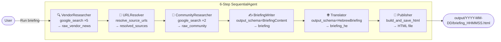
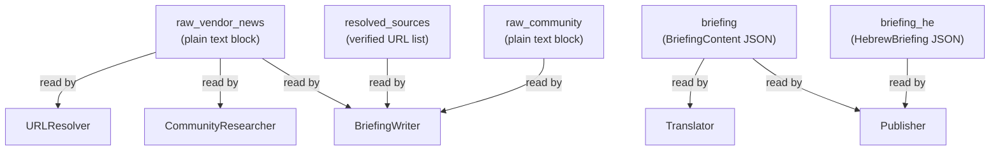

# AI Latest Briefing

A 6-step autonomous agent pipeline that researches the latest AI news from 5 major vendors, finds developer reactions, and produces a clean bilingual HTML newsletter — every time you run it.

Built with [Google ADK](https://google.github.io/adk-docs/) and Gemini 2.5 Flash.

**Medium article**: [How I Replaced My Morning AI News Routine With Google ADK — A 6-Step Multi-Agent Pipeline](https://medium.com/@kobyal/how-i-replaced-my-morning-ai-news-routine-with-google-adk-a-6-step-multi-agent-pipeline-cb38bc857582)

https://github.com/user-attachments/assets/8171ec0a-c5d2-45c7-b679-13b85e0de292


---

## What it produces

A self-contained HTML file with:
- **TL;DR** — 3 cross-vendor highlights
- **5 vendor cards** — Anthropic, AWS, OpenAI, Google, Azure — each with headline, publication date, 2-3 verified source links
- **Community Pulse** — what developers on HN and Reddit are actually saying
- **EN / עברית toggle** — full Hebrew translation of every section

---

## Pipeline



### Why each step exists

| Step | Agent | Tool | Output key | Why |
|------|-------|------|-----------|-----|
| 1 | VendorResearcher | `google_search` | `raw_vendor_news` | Searches one query per vendor, collects headlines + all URLs |
| 2 | URLResolver | `resolve_source_urls` | `resolved_sources` | Follows grounding redirects **immediately** before they expire (~30-60s) |
| 3 | CommunityResearcher | `google_search` | `raw_community` | Searches HN + Reddit for developer reactions to top stories |
| 4 | BriefingWriter | — | `briefing` | Synthesises everything into structured JSON via `output_schema` |
| 5 | Translator | — | `briefing_he` | Translates full briefing to Hebrew via `output_schema` |
| 6 | Publisher | `build_and_save_html` | — | Renders bilingual HTML and saves to `output/` |

---

## Session state flow



Each agent writes one key via `output_key`. Downstream agents reference it in their prompt as `{{state.key}}`. No manual wiring.

---

## Setup

```bash
git clone https://github.com/kobyal/ai-latest-briefing
cd ai-latest-briefing

python -m venv .venv && source .venv/bin/activate
pip install -r requirements.txt

cp .env.example .env
# Fill in your GOOGLE_API_KEY
```

**.env.example:**
```
GOOGLE_API_KEY=your_key_here
GOOGLE_GENAI_MODEL=gemini-2.5-flash
LOOKBACK_DAYS=3  # covers last 3 days; set to 1 for yesterday-only, 7 for weekly digest
```

Get your API key at [aistudio.google.com](https://aistudio.google.com).

---

## Running

### ADK Web UI (recommended for development)

```bash
adk web
```

Open `http://localhost:8000`, select **AILatestBriefing**, and send any message.

The UI shows each agent step as it runs — you can expand any step to inspect what was received and what was output, and see session state values live.

### Programmatically

```python
import asyncio
from google.adk.runners import Runner
from google.adk.sessions import InMemorySessionService
from google.genai import types
from ai_latest_briefing.agent import root_agent

async def run():
    session_service = InMemorySessionService()
    session = await session_service.create_session(
        app_name="briefing", user_id="u1"
    )
    runner = Runner(
        agent=root_agent,
        app_name="briefing",
        session_service=session_service,
    )
    msg = types.Content(
        role="user",
        parts=[types.Part(text="Run the latest briefing")]
    )
    async for event in runner.run_async(
        user_id="u1", session_id=session.id, new_message=msg
    ):
        if event.is_final_response():
            print(event.content)

asyncio.run(run())
```

Output: `output/YYYY-MM-DD/briefing_HHMMSS.html`

---

## Project structure

```
ai-latest-briefing/
├── ai_latest_briefing/
│   ├── agent.py        # Pipeline definition — all 6 LlmAgents + SequentialAgent
│   ├── prompts.py      # Instruction strings for each agent
│   ├── tools.py        # resolve_source_urls + build_and_save_html
│   └── __init__.py
├── output/             # Generated HTML files (gitignored)
├── requirements.txt
└── .env.example
```

---

## Key design decisions

**`output_schema` = no JSON hacks.** Passing a Pydantic model to `output_schema` forces the LLM to return valid, structured JSON. No regex. No parsing. The data arrives ready to use.

**URLResolver runs immediately after VendorResearcher.** Gemini's `google_search` grounding redirects expire in ~30-60 seconds. Resolving them in Step 2 (not Step 6) is the difference between 10-16 working links and 0.

**Broad search queries, not date-pinned.** `"Anthropic Claude latest news March 2026"` surfaces more results than `"Anthropic Claude news March 22, 2026"`. Combined with "prefer recent, don't hard-skip", all 5 vendors always produce a story.

**3 tool parameters, not 16.** Every parameter is a prompt to the LLM. More parameters = more `MALFORMED_FUNCTION_CALL` failures. Keep tools small.

**No mixing built-in + custom tools.** Gemini raises `400 Bad Request` if you combine `google_search` with a custom Python function in the same agent. This forces single-responsibility — which is the right design anyway.

---

## Extending

- **More vendors**: Add searches to `VENDOR_RESEARCHER_PROMPT` in `prompts.py`
- **More languages**: Add a field to `HebrewBriefing` and extend `TRANSLATOR_PROMPT`
- **Automate**: Wrap the programmatic runner in a cron job or GitHub Action
- **Different delivery**: Replace `build_and_save_html` with a Slack webhook or SendGrid tool
- **Weekly digest**: Set `LOOKBACK_DAYS=7` in `.env`
