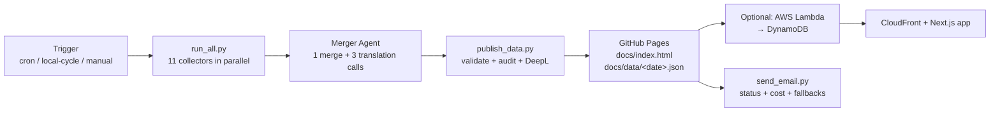

# 00 — Overview

## TL;DR

`ai-news-briefing` is a daily, bilingual (English + Hebrew) AI news briefing produced by 11 independent collector agents and one Merger agent. Every morning, the system reads from vendor blogs, search APIs, X/Twitter, Reddit, GitHub, and YouTube; an LLM merges everything into ~20 ranked stories with full English and Hebrew copy; the result is published as static HTML + structured JSON, optionally fronted by a Next.js app on AWS.

## Who this is for

- **AI watchers** who want one place that surfaces every major release and the developer reaction, instead of subscribing to ten newsletters.
- **Hebrew-speaking developers** who get the same briefing translated by Claude (not Google Translate) into native-quality Hebrew.
- **Hackers thinking about forking** the project as a starting point for their own news/research aggregator. Every external dependency has a fallback; the merger can run free on a Claude Max subscription.

## What the daily output looks like

A single landing page with these sections, each populated automatically:

| Section | Source | Cadence |
|---------|--------|---------|
| **TL;DR (8–10 bullets)** | Merger LLM | every run |
| **News stories (15–25 cards)** | 4 core LLM agents + Article Reader full-text, merged by Claude | every run |
| **Community pulse (5–7 items)** | Merger LLM, sourced from X / Reddit / HN signals | every run |
| **Top X people highlights** | Twitter scrape (or xAI Grok fallback) | every run |
| **Trending X posts** | Twitter scrape | every run |
| **Reddit hot threads** | RSS agent via Arctic Shift, top by comment count | every run |
| **Top YouTube videos** | YouTube agent (35 curated channels + targeted search) | every run |
| **GitHub trending repos** | GitHub agent (6 search queries + 15 tracked repos for releases) | every run |

Every news card has:

- A vendor badge (Anthropic / OpenAI / Google / AWS / Azure / Meta / xAI / NVIDIA / Mistral / Apple / Hugging Face / Alibaba / DeepSeek / Samsung / Other)
- 2–4 source URLs (filtered by a 3-layer URL defense — see [16-publish-pipeline](./16-publish-pipeline.md))
- A 3–4 paragraph English body + matching Hebrew translation
- An open-graph image (with vendor-logo / Wikipedia / GitHub-org-logo fallbacks)

## What's running where

The repo's public contract ends at `docs/`. Everything from GH Pages onwards is optional — fork users can stop there and have a complete product.

## Key technical decisions

- **9 agents instead of 1 big LLM call.** Each surface (live web search, vendor blog feeds, semantic search, social) has a different retrieval shape. Running them in parallel means no single provider outage breaks the briefing, and each agent specializes. The merger can be relatively dumb because the inputs are already curated.

- **Two ways to run the merger.** Anthropic API (~$0.76/run) or `MERGER_VIA_CLAUDE_CODE=1` (Claude Max subscription, $0/call). The two paths share the same code via `shared/anthropic_cc.py`. A marker file `.via_subscription.done` lets local subscription runs and CI cron coexist without double-billing.

- **Three-layer URL defense.** (a) merger prompt forbids inventing URLs, (b) merger pipeline drops URLs not in source briefings, (c) `publish_data.py` drops URLs whose page title shares zero keywords with the story headline + drops aggregator/roundup posts. Prevents cross-story URL mis-assignment.

- **Visibility before features.** `send_email.py` sends a daily status email with `AGENT DELIVERY` (per-agent counts vs 7-day average), `FRESHNESS WATCH` (multi-day-zero output flagged), `TOKEN USAGE` (cost per agent), `FALLBACKS FIRED` (rotation counts), and `PROBLEMS` (audit issues). The rule: if a regression doesn't show up in the email, it doesn't exist.

## What's not in this repo

The maintainer's deployment has two extra components that are **separate repos**, not synced to this one:

- **`web/`** — Next.js static-export site, deployed to S3 + CloudFront. Reads `docs/data/<date>.json` (or its DynamoDB mirror). See [18-website-frontend](./18-website-frontend.md).
- **`infra/`** — AWS CDK (Python). Five stacks: `DatabaseStack`, `TriggerStack`, `IngestStack`, `ApiStack`, `FrontendStack`. See [17-distribution-aws](./17-distribution-aws.md).

For a fork, both are optional. Read the chapter pair to decide whether you want to recreate them in your fork.

## Where to go next

- **[01-high-level-flow](./01-high-level-flow.md)** — the big-picture diagram showing how every component connects (recommended next).
- **[02-architecture-layers](./02-architecture-layers.md)** — the 6-layer mental model.
- **[03-trigger-and-runtime](./03-trigger-and-runtime.md)** — how a run actually starts.
