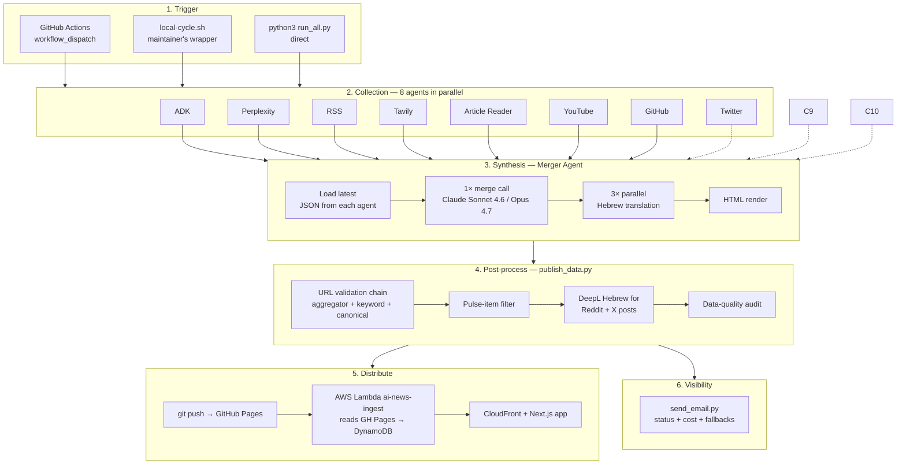
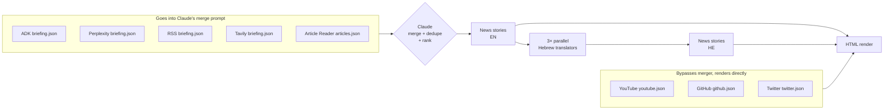

# 01 — High-level flow

## TL;DR

A daily run starts with a trigger, fans out across 11 collector agents, joins back into the Merger, fans out again into 3 parallel translation calls, then reduces to a single HTML + JSON pair that gets pushed to GitHub Pages. Optionally, AWS Lambda picks up the JSON and ingests it into DynamoDB so the Next.js frontend can serve it through CloudFront. The daily email closes the loop with health + cost reporting.

## The full picture in one diagram

Solid arrows mean the merger reads the agent's content into its prompt. Dashed arrows mean the agent's output bypasses the merger and renders directly (YouTube videos, GitHub repos, Twitter people highlights).

## How the pieces connect

**Trigger → Collection.** A trigger calls `python3 run_all.py [--skip xai]`. `run_all.py` is the orchestrator. It launches each agent's `run.py` as a subprocess in a `ThreadPoolExecutor`-style fan-out. Default per-process timeout is 1200 seconds. Agents communicate only by writing JSON to disk under `<agent>/output/<YYYY-MM-DD>/`.

**Collection → Synthesis.** When all 8 collectors are done (or timed out), `run_all.py` invokes the merger as a final, blocking step. The merger uses `glob` to find the most recent JSON output for each agent in today's date directory. Missing agents are tolerated — the merger's prompt accepts thin inputs.

**Synthesis → Post-process.** The merger writes `merged_<HHMMSS>.{html,json}` and the marker file. `publish_data.py` reads the merger's output, plus the latest from `youtube`, `github`, and `twitter` (these bypass merger). It runs URL validation, the canonical-URL prepend pass, the pulse-item fabrication filter, DeepL translation for Reddit/X, the OG image fetch, and finally `_audit_data_quality()`. Output: `docs/data/<date>.json`.

**Post-process → Distribute.** `local-cycle.sh` (or CI workflow) runs `git push` after `publish_data.py`. GitHub Pages picks up the push within ~30–60 seconds. If AWS is wired up, a Lambda function fetches the JSON from GH Pages and writes it to DynamoDB. CloudFront serves the Next.js app with the JSON proxied through API Gateway.

**Post-process → Visibility.** `send_email.py` runs after `publish_data.py` and computes per-agent delivery counts (today vs 7-day baseline), token usage, fallback events, and data-quality issues. The email is the single source of truth for "did everything work today?"

## Read-flow inside the merger

The merger doesn't process all inputs equally. Some go straight into the LLM prompt; some bypass it.

Why the split: news cards (vendor announcements, papers, deals) are messy and need merging. Videos, repos, and Twitter posts already arrive in clean, structured form — feeding them through an LLM would only add latency and risk hallucination.

## Failure isolation between layers

A clean property of this design: layers fail independently.

- **One agent dies** → 9 others still run; merger handles thin input gracefully.
- **Merger dies** → re-run with `--merge-only` once collectors have written their JSON.
- **`publish_data.py` dies** → re-run standalone (it reads merger + agent JSON files, no API calls except DeepL).
- **GitHub Pages slow to publish** → `local-cycle.sh` polls until the new content is served (max 3 min) before invoking the Lambda.
- **Lambda fails** → the GH Pages JSON is still served as the public contract; the maintainer's CloudFront app is degraded but everyone else's view is fine.

Each layer has a defined output that downstream steps can rely on. That makes the system debuggable.

## Where to go next

- **[02-architecture-layers](./02-architecture-layers.md)** — the same flow framed as 6 layers, with what each layer is responsible for.
- **[03-trigger-and-runtime](./03-trigger-and-runtime.md)** — how a run actually starts (CI / local / manual).
- **[15-merger](./15-merger.md)** — what the merger's prompt looks like.
