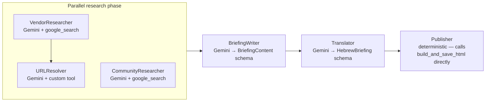

# 05 — Agent: ADK (Google ADK + Gemini)

## TL;DR

ADK is the Google Agent Development Kit pipeline. It uses `gemini-2.5-flash` with the built-in `google_search` tool to find recent vendor news and developer reactions, resolves the Google grounding redirect URLs to their canonical destinations, then writes a structured briefing in English + Hebrew. As of 2026-04-28, the Publisher step is deterministic (not LLM-driven) after Gemini started returning empty responses for the trivial "call this tool" prompt.

## Why this surface

Gemini + `google_search` gives the freshest possible signal. Unlike RSS (which depends on vendor publishing rhythm), Google indexes everything within minutes. ADK is the agent most likely to surface news that broke in the last hour.

Tradeoffs:

- **Slower than other agents.** VendorResearcher alone routinely takes 90–260 seconds because Gemini's grounding pass is sequential (search → resolve → search → resolve).
- **Most expensive collector.** ~$0.04/run (input tokens dominate).
- **URLs need resolution.** Google's grounding returns redirect URLs like `vertexaisearch.cloud.google.com/grounding-api-redirect/...` which are short-lived. The URLResolver step expands them to canonical URLs while they're still valid.

## Architecture



The `VendorPipeline` (Vendor → URLResolver) runs in **parallel** with `CommunityResearcher` via `ParallelAgent`. Both branches finish before `BriefingWriter` starts. Saves ~33% wall-clock vs sequential.

Why URLResolver is its own agent (not done in VendorResearcher): Gemini doesn't allow mixing `google_search` and custom tools in the same agent. So we split the search step (uses `google_search`) from the resolution step (uses our `resolve_source_urls` Python function as a custom tool).

## Run

```bash
cd adk-news-agent
python3 run.py
```

Or via `run_all.py`:

```bash
python3 run_all.py --only adk
```

## Key environment variables

| Var | What it does |
|-----|---------------|
| `GOOGLE_API_KEY` | Gemini API key (required) |
| `GOOGLE_GENAI_MODEL` | Model name; default `gemini-2.5-flash` |
| `LOOKBACK_DAYS` | Search lookback; default 3 |
| `ADK_TIMEOUT` | Internal pipeline cap; default 900s |

## Output

- `adk-news-agent/output/<date>/briefing_<HHMMSS>.json` — structured briefing for the merger
- `adk-news-agent/output/<date>/usage_<HHMMSS>.json` — per-call Gemini token + cost log

(There used to be a per-agent `briefing_<HHMMSS>.html` newsletter as well. It was dropped on 2026-05-03 — nothing read it. The merger writes the only user-facing HTML.)

JSON shape:

```json
{
  "source": "adk",
  "briefing": {
    "tldr": ["..."],
    "news_items": [
      {
        "vendor": "Anthropic",
        "headline": "...",
        "published_date": "April 27, 2026",
        "summary": "...",
        "urls": ["https://...", "https://..."]
      }
    ],
    "community_pulse": "• ...",
    "community_urls": []
  },
  "briefing_he": {
    "tldr_he": ["..."],
    "news_items_he": [{"headline_he": "...", "summary_he": "..."}],
    "community_pulse_he": "..."
  }
}
```

## Failure modes and how they're handled

### 1. Internal timeout

`adk-news-agent/adk_news_agent/pipeline.py::_TIMEOUT` (default 900s) bounds the whole `runner.run_async` call. If the internal pipeline takes longer (slow Gemini day, rate limit), the timeout fires. The handler catches `asyncio.TimeoutError` and prints a warning.

After the timeout (or normal completion), pipeline.py runs a **post-completion check**: glob `output/<today>/briefing_*.json` and raise `RuntimeError` if no file exists. This converts the silent-success failure mode (timeout → exit 0 → merger uses yesterday's stale ADK file) into a loud failure (`run_all.py` reports `✗ FAILED`).

### 2. Empty Publisher response

(History: Gemini started returning `parts=None role='model'` for the Publisher prompt sometime between 2026-04-25 and 2026-04-28. The Publisher's only job was to call `build_and_save_html()` — but Gemini wasn't calling it.)

Fix in `agent.py`: removed `Publisher` from the `SequentialAgent.sub_agents` chain.

Fix in `pipeline.py`: after the LLM chain finishes, the deterministic Publisher runs:

```python
state = (await session_service.get_session(...)).state
if state.get("briefing"):
    from .tools import build_and_save_html
    class _StubCtx: ...
    build_and_save_html(topic="AI", tool_context=_StubCtx(state))
```

This bypasses the broken LLM round-trip entirely. The function reads `briefing` and `briefing_he` from session state and writes the file.

### 3. Quota exhaustion

If the Gemini key hits its daily quota mid-run, Gemini returns 429 → ADK aborts. The merger uses whatever was written before the abort (potentially nothing for today). The next day's run starts fresh with a renewed quota.

### 4. URL resolution timeout

Each URL in `resolve_source_urls` is fetched with an 8-second timeout. Slow domains return `None` and are skipped. Up to 30 verified URLs are returned per run. The resolver doesn't retry — a slow fetch is treated as a dead URL.

## Code tour

| File | What it does |
|------|---------------|
| `run.py` | Entry point: loads `.env`, calls `run_pipeline()`. |
| `adk_news_agent/agent.py` | `LlmAgent` definitions, `SequentialAgent` + `ParallelAgent` orchestration. Pydantic schemas (`BriefingContent`, `HebrewBriefing`). |
| `adk_news_agent/pipeline.py` | `_run_async()` — drives the ADK runner; deterministic Publisher; post-run validation; usage logging. |
| `adk_news_agent/prompts.py` | All prompt templates (VendorResearcher, URLResolver, CommunityResearcher, BriefingWriter, Translator, Publisher). |
| `adk_news_agent/tools.py` | `resolve_source_urls()`, `_parse()` (JSON repair), `build_and_save_html()` (now JSON-only despite the name — kept for ADK tool registration). |

## Cool tricks

- **`google_search` + custom tools constraint.** ADK doesn't let an LlmAgent mix `google_search` with other tools. The two-step Vendor → URLResolver pattern is how you work around it.
- **`output_schema`-driven structured output.** `BriefingWriter` and `Translator` use Pydantic `output_schema` to force Gemini to return parseable JSON. The `output_key` writes the parsed object straight into session state, where downstream agents (and now our deterministic Publisher) read it.
- **Per-call usage logging.** ADK's event stream exposes `usage_metadata.prompt_token_count` and `candidates_token_count` per LlmAgent invocation. Pipeline iterates events, sums tokens × Gemini per-1M rates from `_GEMINI_PRICES`, and writes `usage_<HHMMSS>.json`. This is what `send_email.py` reads to show ADK's daily cost.

## Where to go next

- **[06-agent-perplexity](./06-agent-perplexity.md)** — the contrasting LLM-search agent (Sonar instead of Gemini).
- **[15-merger](./15-merger.md)** — what the merger does with ADK's output.
