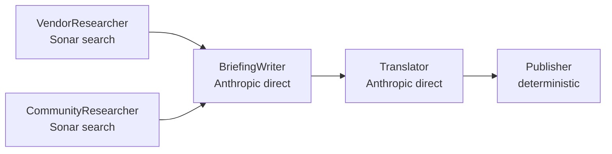

# 06 — Agent: Perplexity

## TL;DR

The Perplexity agent uses Sonar models for live web search (their core strength) and routes the writer + translator steps directly to the Anthropic SDK (Claude Haiku 4.5). After this routing change on 2026-04-23, per-run cost dropped from ~$1.55 to ~$0.12 — a 92% reduction with no measurable quality drop.

## Why this surface

Perplexity's Sonar models are tuned for grounded web search with citation links. They're consistently better at finding niche AI news than Google grounding (which over-indexes on big-publisher coverage). Sonar returns results with `usage.cost.total_cost` in the response, which is how we get authoritative per-call billing.

The split between Sonar (search) and Anthropic (writing/translating) reflects what each provider does best:

- Sonar — best at finding fresh AI news with sources.
- Claude Haiku — much cheaper and equally good at synthesizing already-fetched content into structured JSON.

## Architecture



VendorResearcher and CommunityResearcher run sequentially (Perplexity has tighter rate limits than Google, parallel buys little). Both feed BriefingWriter, which produces structured JSON. Translator turns that into Hebrew. Publisher writes HTML + JSON to disk.

## Run

```bash
cd perplexity-news-agent
python3 run.py
```

## Key environment variables

| Var | What it does |
|-----|---------------|
| `PERPLEXITY_API_KEY` | Sonar search (required) |
| `ANTHROPIC_API_KEY` | Writer + translator (required since 2026-04-23 routing) |
| `MERGER_VIA_CLAUDE_CODE=1` | Optional — route Anthropic via subscription |
| `PERPLEXITY_SEARCH_MODEL` | Sonar model; default in code |
| `PERPLEXITY_WRITER_MODEL` | Writer model name (used to resolve to Anthropic model) |
| `PERPLEXITY_TRANSLATOR_MODEL` | Translator model name |
| `LOOKBACK_DAYS` | Search lookback window; default 3 |

## Output

- `perplexity-news-agent/output/<date>/briefing_<HHMMSS>.{html,json}`
- `perplexity-news-agent/output/<date>/usage_<HHMMSS>.json`

JSON shape matches the ADK shape (every core agent has the same `briefing.{tldr, news_items, community_pulse}` schema so the merger can read them uniformly).

## The routing change

Before 2026-04-23, every Perplexity-agent LLM call went through Perplexity's `/v1/responses` endpoint. The endpoint's Anthropic-routing path adds a markup over Anthropic's direct pricing:

| Path | Per-call markup | Notes |
|------|-----------------|-------|
| Direct Anthropic API | 0% | The reference rate. |
| Perplexity `/v1/responses` proxying Claude | ~10–13× higher | Measured 2026-04 |

The agent now does:

```python
def _agent(input_text, *, model, ...):
    """One-shot LLM call. Sonar models go to Perplexity; Anthropic models go direct."""
    if model.startswith("anthropic/") or model.startswith("claude-"):
        return _anthropic_direct(input_text, model=_strip_anthropic_prefix(model), ...)
    else:
        return _perplexity_call(input_text, model=model, ...)
```

`_anthropic_direct` uses `anthropic.Anthropic().messages.create(...)`, or, if `MERGER_VIA_CLAUDE_CODE=1`, routes through `shared/anthropic_cc.py::agent` for the subscription path.

The code change was small (~30 lines) but the cost impact was the biggest single improvement in the project's history.

## Failure modes

### Sonar quota exhausted

Perplexity returns 429. `_perplexity_call` retries with 5/15/30s backoff (3 attempts). If all fail, the affected step writes empty content and the agent continues. The merger handles missing Perplexity input gracefully.

### Anthropic key missing on subscription path

If `MERGER_VIA_CLAUDE_CODE=1` and `claude` CLI is unavailable, `shared/anthropic_cc.py::agent` raises. Currently no automatic fallback to the API path — the user needs to unset `MERGER_VIA_CLAUDE_CODE` and re-run with `ANTHROPIC_API_KEY` set.

### Sonar model returns no `usage.cost.total_cost`

Older Sonar variants don't return the cost field. The fallback is to compute cost from a hard-coded `_PERPLEXITY_PRICES` table. This is rarely exercised — modern Sonar models all return cost.

## Code tour

| File | What it does |
|------|---------------|
| `run.py` | Entry point. |
| `perplexity_news_agent/pipeline.py` | `_step1_research`, `_step2_writer`, `_step3_translate`, `_step4_publish`. The `_anthropic_direct` helper handles both API and subscription paths. |
| `perplexity_news_agent/prompts.py` | Vendor research, community research, writer, translator prompts. |
| `perplexity_news_agent/tools.py` | `_parse()` — JSON repair (markdown fences, Hebrew gershayim). *(Used to also do HTML rendering — removed 2026-05-03 as nothing read it.)* |

## Cool tricks

- **Authoritative Perplexity cost.** Sonar responses include `usage.cost.total_cost` — we don't have to compute cost from token counts × hard-coded rates. This is more accurate (Perplexity sometimes runs internal tools that aren't visible in token counts).
- **Hybrid routing in one helper.** `_agent(input_text, model=...)` switches between Perplexity and Anthropic based on the model name prefix. Calling code doesn't care which provider it hits — same call signature, same return type. Good pattern for multi-provider agents.
- **Subscription-path opt-in via shared helper.** `_anthropic_direct` checks `MERGER_VIA_CLAUDE_CODE` env via `shared/anthropic_cc.is_enabled()`. One env var flips every Anthropic call across the whole pipeline.

## Where to go next

- **[07-agent-rss](./07-agent-rss.md)** — the deterministic-fetch alternative.
- **[20-cost-and-fallbacks](./20-cost-and-fallbacks.md)** — the full cost picture.
