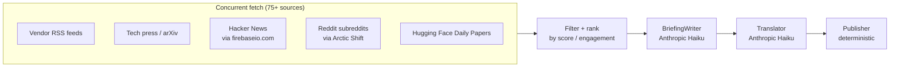

# 07 — Agent: RSS

## TL;DR

The RSS agent is the deterministic, no-LLM-search collector. It pulls from 75+ feeds — vendor blogs (Anthropic, OpenAI, Google, AWS, Azure, Meta, NVIDIA, Mistral, Apple, Hugging Face, Alibaba), tech press (TechCrunch, VentureBeat, The Verge, Ars Technica, MIT Tech Review), arXiv, newsletters (ImportAI, The Batch, Simon Willison), Hacker News, and Reddit (via Arctic Shift, no auth required). LLM work only enters at synthesis. Vendor RSS uses a 7-day lookback (others use the global `LOOKBACK_DAYS=3`).

## Why this surface

Search APIs (Google grounding, Sonar) are great for "what happened today" but they're stochastic — same query, different results. RSS feeds are deterministic — every vendor blog post will be in the feed, and every Hacker News top-100 story is reachable via the API.

Reddit and HN add the *community* axis: what developers are arguing about, not just what got announced. The RSS agent reads them through stable APIs that don't require auth (Arctic Shift) or use `firebaseio.com` (HN).

## Architecture



The fetch phase runs everything concurrently in a `ThreadPoolExecutor(max_workers=8)`. Network I/O dominates wall-clock; LLM work is small.

## Run

```bash
cd rss-news-agent
python3 run.py
```

## Key environment variables

| Var | What it does |
|-----|---------------|
| `ANTHROPIC_API_KEY` | Writer + translator |
| `MERGER_VIA_CLAUDE_CODE=1` | Optional subscription path |
| `RSS_WRITER_MODEL` | Default `claude-haiku-4-5-20251001` |
| `RSS_TRANSLATOR_MODEL` | Default `claude-haiku-4-5-20251001` |
| `LOOKBACK_DAYS` | Default 3 (vendor RSS overrides to 7) |

## Output

- `rss-news-agent/output/<date>/rss_<HHMMSS>.{html,json}`
- `rss-news-agent/output/<date>/usage_<HHMMSS>.json`

The JSON has the standard core-agent shape, plus a top-level `reddit_posts` array that's used by `publish_data.py` to render the dedicated Reddit section on the live site.

## The 7-day vendor lookback

(Recent change: 2026-04-28.)

Originally all RSS feeds used the global `LOOKBACK_DAYS=3` cutoff. Vendor blog post density is low (~5/day across all blogs combined) and launch announcements stay relevant for a week. The 3-day cutoff was excluding launches from a week ago that were still being discussed.

Concrete example: AWS Bedrock AgentCore launched on 2026-04-22. The 2026-04-28 publish run with `LOOKBACK_DAYS=3` (Apr 25–28) couldn't see the canonical announcement. The fix:

```python
# rss-news-agent/.../feeds.py::fetch_all
since = datetime.now(tz=timezone.utc) - timedelta(days=lookback_days)
vendor_since = min(since, datetime.now(tz=timezone.utc) - timedelta(days=7))
# vendor RSS uses vendor_since (≥7 days)
# HN, HF papers, Reddit use the original since (3 days, except Reddit's own 7-day override)
```

`min(since, 7-days-ago)` picks the *earlier* date so we always look back at least 7 days for vendor posts, while preserving the global lookback for community sources where 7 days of HN top stories would be noisy.

## Reddit via Arctic Shift

Reddit's official API requires OAuth. Reddit's `r/<sub>/.json` blocks unauthenticated requests with 403. **Arctic Shift** (`arctic-shift.photon-reddit.com`) is a third-party archive that mirrors Reddit posts and serves them via an unauthenticated REST API.

Subreddits monitored:

- `r/MachineLearning`
- `r/LocalLLaMA`
- `r/artificial`
- `r/singularity`
- `r/ChatGPT`
- `r/ClaudeAI`
- `r/OpenAI`
- `r/GoogleGemini`
- `r/Anthropic`
- `r/AINews`

The `_fetch_arctic_shift` function uses a **7-day lookback** (regardless of the global setting) because Reddit posts often peak in engagement 1–3 days after they're posted, and we want today's "hot" thread, not just today's "newest" thread.

`limit` is capped at 100 (was 200; 200 returned 400 errors after Arctic Shift updated their API).

## How vendor classification works

When a feed is generic (e.g., TechCrunch's AI category), the post's `feed_vendor` is `"Other"`. We then run `_infer_vendor()` which scans the post title + summary against `shared/vendors.py::VENDOR_KEYWORDS`:

```python
def _infer_vendor(title, summary, feed_vendor) -> str:
    text = (title + " " + summary).lower()
    for vendor, kws in VENDOR_KEYWORDS.items():
        if any(kw in text for kw in kws):
            return vendor
    return feed_vendor
```

This way, a TechCrunch post about Anthropic's funding round gets `vendor="Anthropic"` instead of `"Other"`.

## Failure modes

### Feed temporarily down

`_fetch_rss` catches all exceptions per-feed. A failing feed returns `[]` and the others continue. There's no retry; one missed feed is rarely consequential because most stories appear in 3+ feeds.

### Arctic Shift 400/429

If Arctic Shift starts rate-limiting, the affected subreddits return empty lists. The `reddit_posts` array gets thinner. `publish_data.py` filters to score ≥ 20 (which the Reddit hot path naturally satisfies), so a few missed subreddits don't hurt the daily Reddit section much.

### Anthropic Haiku quota

Same retry pattern as the Perplexity agent — 3 attempts with 5/15/30s backoff. If all fail, the writer step writes empty content. The merger handles thin RSS input.

## Code tour

| File | What it does |
|------|---------------|
| `run.py` | Entry point. |
| `rss_news_agent/feeds.py` | `FEEDS` registry; per-type fetchers (`_fetch_rss`, `_fetch_hn`, `_fetch_arctic_shift`, `_fetch_hf_papers`); `fetch_all` orchestration. |
| `rss_news_agent/pipeline.py` | `_step1_collect_rss` → `_step2_writer` → `_step3_translate` → `_step4_publish`. |
| `rss_news_agent/tools.py` | `_parse()` — JSON repair (markdown fences, Hebrew gershayim). *(Used to also do HTML rendering — removed 2026-05-03 as nothing read it.)* |

## Cool tricks

- **Per-feed-type fetchers.** RSS, HN, HF papers, Arctic Shift Reddit each have their own fetcher with custom logic. The `FEEDS` registry tags each entry with a `type`; `fetch_all` dispatches to the right fetcher. Trivial to add a new type (Substack via Atom, GitHub releases, Mastodon).
- **Reddit hot via Arctic Shift.** No auth, no OAuth dance, no API keys. The trick is using `arctic-shift.photon-reddit.com/api/posts/search?subreddit=...` with a `min_score` filter and a 7-day window. Arctic Shift mirrors Reddit's data so you get fresh posts without dealing with Reddit's auth requirements.
- **`_score` field for ranking.** Each fetcher attaches a `_score` (RSS posts get 0, HN posts get their points, Reddit posts get comment count). The pipeline sorts by `_score` to surface the most-engaged content first.

## Where to go next

- **[08-agent-tavily](./08-agent-tavily.md)** — the search-API contrast.
- **[14-agent-twitter](./14-agent-twitter.md)** — another "no API key" pattern.
- **[20-cost-and-fallbacks](./20-cost-and-fallbacks.md)** — what happens if a fetcher dies.
