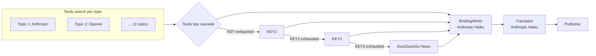

# 08 — Agent: Tavily

## TL;DR

The Tavily agent does targeted news search across 11 vendor topics using Tavily's Search API. It rotates through 3 keys when one hits its quota (`TAVILY_API_KEY → KEY2 → KEY3`), and falls back to DuckDuckGo News if all three are exhausted. Writer + translator are Anthropic Haiku — same pattern as RSS and Perplexity.

## Why this surface

Tavily is purpose-built for LLM-grounded news search. It returns clean JSON with `title`, `url`, `published_date`, and a snippet — no HTML scraping, no broken markup. For "give me 5 recent articles about Anthropic releases," Tavily is the most reliable single API.

Compared to the others:

- **vs Sonar (Perplexity).** Both do live web search. Tavily is more deterministic (less LLM in the loop); Sonar is better at "what's the consensus on X."
- **vs `google_search` (Gemini).** Tavily returns just URLs; Gemini's grounding tries to summarize. We want raw URLs to send through the URL filter, so Tavily wins for our use case.
- **vs RSS.** Tavily covers more sources (any indexed web page); RSS only covers explicit feeds.

## Architecture



## Run

```bash
cd tavily-news-agent
python3 run.py
```

## Key environment variables

| Var | What it does |
|-----|---------------|
| `TAVILY_API_KEY` | Primary key |
| `TAVILY_API_KEY2` | First backup |
| `TAVILY_API_KEY3` | Second backup |
| `ANTHROPIC_API_KEY` | Writer + translator |
| `MERGER_VIA_CLAUDE_CODE=1` | Optional subscription path |
| `TAVILY_WRITER_MODEL` | Default `claude-haiku-4-5-20251001` |
| `TAVILY_TRANSLATOR_MODEL` | Default `claude-haiku-4-5-20251001` |
| `LOOKBACK_DAYS` | Default 3 |

## The 3-key cascade

Tavily's free tier is generous but not unlimited (~1000 searches per key per month on the Researcher plan). The maintainer has 3 keys total: 2 from kobyal@gmail.com and 1 from a secondary Google account. They rotate as one fills:

```python
# tavily-news-agent/tavily_news_agent/searcher.py — abridged
def search(query, ...):
    for attempt in range(3):
        try:
            return _client.search(query, ...)
        except TavilyError as e:
            if any(s in str(e).lower() for s in ["limit", "quota", "429", "insufficient"]):
                _switch_to_backup()  # KEY → KEY2 → KEY3
                continue
            raise
    return _ddg_search(query, ...)  # all keys exhausted
```

Every rotation calls `fallback_tracker.track("tavily", from_key, to_key, "quota/rate-limit")`. The daily email's `FALLBACKS FIRED` panel surfaces these counts so it's visible when keys are saturating.

Reality of the maintainer's keys (snapshot mid-April 2026):

| Key | Status |
|-----|--------|
| `TAVILY_API_KEY` | 1010/1000 — exhausted, 432 errors |
| `TAVILY_API_KEY2` | 904/1000 — 90% used |
| `TAVILY_API_KEY3` | 550/1000 — healthy |

Rotation fires every run; the chain is holding. DDG fallback rarely triggers.

## DuckDuckGo last-resort

`_ddg_search()` uses `duckduckgo-search` (Python package) to query DDG News. DDG returns less-structured results than Tavily — title, URL, snippet, but no consistent `published_date`. We attempt to parse the date from the snippet (`re.search(r"\d{1,2} (Jan|Feb|...) 2026", snippet)`); if it fails, we set `published_date = "Date unknown"`.

DDG's ~30 queries-per-IP-per-minute limit is the bottleneck. With 11 topics + sequential calls, we stay well under. If DDG starts rate-limiting, the affected topics return empty.

## Output

- `tavily-news-agent/output/<date>/tavily_<HHMMSS>.{html,json}`
- `tavily-news-agent/output/<date>/usage_<HHMMSS>.json`

JSON shape: standard core-agent.

## Failure modes

### All 3 keys + DDG fail

The agent's writer step gets very thin input (some topics may have 0 articles). The merger handles this fine — Tavily is one of 4 core agents, the others backfill.

### Anthropic Haiku quota

Same retry pattern as Perplexity/RSS — 3 attempts with 5/15/30s backoff. If exhausted, writer step writes empty content; merger handles thin Tavily input.

### Tavily plan downgrade

When a key drops from Researcher to Free tier (after a billing cycle), max search depth and result count drop. The agent doesn't auto-detect this; you'd notice it as fewer URLs per topic in the daily output.

## Code tour

| File | What it does |
|------|---------------|
| `run.py` | Entry point. |
| `tavily_news_agent/searcher.py` | `search()`, key rotation, DDG fallback, `fallback_tracker` integration. |
| `tavily_news_agent/pipeline.py` | `_step1_search`, `_step2_writer`, `_step3_translate`, `_step4_publish`. |
| `tavily_news_agent/prompts.py` | Per-topic prompt templates. |
| `tavily_news_agent/tools.py` | HTML rendering. |

## Cool tricks

- **Error-string-based rotation detection.** No clean Tavily SDK error class for "you hit your quota" — the substring match (`limit | quota | 429 | insufficient`) covers all observed cases. Pragmatic and stable.
- **Tracker-based observability.** Every rotation writes one JSON line to `/tmp/_fallbacks.jsonl`. The email's panel aggregates by `from → to | count`. You can see at a glance: "tavily KEY → KEY2 ×3, KEY2 → KEY3 ×2 today" — that's the chain holding under load.
- **Two-account key pairing.** The maintainer has two Google accounts (`kobyal@gmail.com` + `kobytestalmog@gmail.com`); each generates a Tavily/Exa/Jina free-tier key. The `_2` suffix convention (`TAVILY_API_KEY2`, `EXA_API_KEY2`, `JINA_API_KEY2`) flags secondary keys uniformly across providers.

## Where to go next

- **[09-agent-article-reader](./09-agent-article-reader.md)** — uses Tavily as one of its search-fallback paths.
- **[20-cost-and-fallbacks](./20-cost-and-fallbacks.md)** — the full fallback story.
