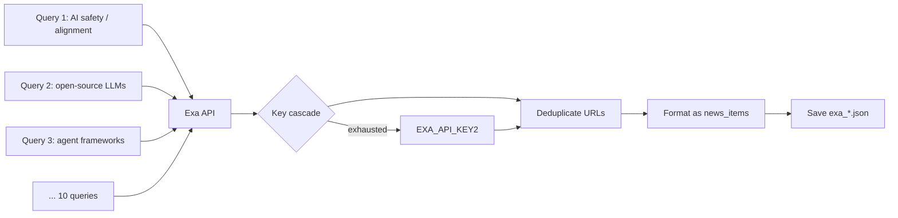

# 10 — Agent: Exa

> **⚠️ RETIRED 2026-05-03.** The Exa agent was dropped from `run_all.py` after an audit found Exa's stories had a ~5% pass-rate through the merger — its niche semantic-search results were almost always already covered by Tavily / Perplexity / RSS. The directory `exa-news-agent/` and the linked NotebookLM video remain in the repo for historical reference, but Exa is no longer part of the daily pipeline. See [04 — Collection pattern](./04-collection-pattern.md) for the current 8-agent lineup.

## TL;DR

Exa is the semantic search layer for niche or technical AI stories that broader web/news search misses. The agent fires 10 hand-tuned queries through Exa's API, deduplicates URLs, and saves the results as supplemental sources for the merger. It's a no-LLM agent — Exa returns clean structured results, no synthesis needed at this stage.

## Why this surface

Most search APIs (Google, Tavily, Sonar) return results based on keyword + recency + popularity. Exa is different: it returns results based on *semantic similarity* to the query embedding. That makes it good at finding:

- Long-tail academic posts (alignment, mech interp, RLHF papers nobody's tweeted yet)
- Technical comparison writeups ("how does X actually compare to Y")
- Indie blog posts on niche topics
- Posts from voices not on the major news circuit

It's an additive layer — what Exa surfaces *complements* what ADK/Perplexity/Tavily surface, rather than overlapping with them.

## Architecture



## Run

```bash
cd exa-news-agent
python3 run.py
```

## Key environment variables

| Var | What it does |
|-----|---------------|
| `EXA_API_KEY` | Primary key (kobyal account) |
| `EXA_API_KEY2` | Backup (kobytest account, different team ID) |
| `LOOKBACK_DAYS` | Search lookback; default 3 |

## Output

- `exa-news-agent/output/<date>/exa_<HHMMSS>.json`

Shape:

```json
{
  "source": "exa",
  "briefing": {
    "news_items": [
      {
        "vendor": "Anthropic",
        "headline": "...",
        "published_date": "April 27, 2026",
        "summary": "...",
        "urls": ["https://..."]
      }
    ]
  }
}
```

The merger reads `briefing.news_items` and treats them as supplementary stories to merge with the four core agents' output.

## The 10 queries

Hand-tuned in the pipeline source. Examples:

- "newest large language model releases"
- "latest AI safety research papers"
- "open-source LLM frameworks released this week"
- "agent framework benchmarks"
- "RLHF and alignment techniques"
- "AI infrastructure announcements"
- "reasoning models and chain-of-thought"
- "vision-language models progress"
- "AI hardware and inference"
- "developer tools for LLMs"

The queries are deliberately not vendor-specific. ADK and Tavily already do vendor-specific searches; Exa fills in the topical gaps.

## Two-key rotation (no tracker yet)

Exa's free tier is small — `EXA_API_KEY` (kobyal) and `EXA_API_KEY2` (kobytest) provide two separate quotas. Rotation is handled inline:

```python
# exa-news-agent/exa_news_agent/pipeline.py — pattern
try:
    results = exa.search(query, ...)
except QuotaError:
    if not switched_to_backup:
        exa = Exa(EXA_API_KEY2)
        switched_to_backup = True
        results = exa.search(query, ...)
    else:
        results = []  # both keys exhausted
```

This rotation isn't yet wired into `shared/fallback_tracker` (it's on the "missing tracking" list — see [20-cost-and-fallbacks](./20-cost-and-fallbacks.md)). Adding it is a 3-line change.

## How dedup works

URLs are normalized (strip trailing slashes, lowercase host) and deduplicated. If Exa returns the same article from two different queries, it's kept once. Cross-agent dedup (against ADK/Perplexity/Tavily output) is the merger's job, not Exa's.

## Failure modes

### Both keys 403

Both Exa keys returned 403 simultaneously for a stretch in 2026-04 — turned out to be the probe code in `send_email.py` using the wrong request body shape (camelCase `numResults` instead of snake_case `num_results`). Direct curl with the correct body confirmed both keys were live.

Lesson: a probe returning 403 doesn't always mean the key is dead. Always verify with a direct curl before declaring a key revoked.

### Quota exhausted on both keys

The agent writes `news_items: []` and the merger runs without Exa content. Not catastrophic — Exa is supplemental.

### Single query times out

Each query has its own try/except. One slow query produces empty results; the others continue. The agent never fails the whole run because of one query.

## Code tour

| File | What it does |
|------|---------------|
| `run.py` | Entry point. |
| `exa_news_agent/pipeline.py` | Query list, key rotation, dedup, output formatting. |

Tiny codebase — Exa returns clean structured data, so there's almost nothing to translate or synthesize.

## Cool tricks

- **Hand-tuned semantic queries.** Each of the 10 queries was chosen to surface things the keyword-search agents *miss*. Exa's `find_similar` could automate query expansion, but the curated list is more controllable. Worth tuning if the merger output starts feeling repetitive.
- **`exa_py` SDK over raw HTTP.** The Python SDK uses correct snake_case body parameters automatically. Direct HTTP works too but you have to mirror the SDK's request shape (`num_results` not `numResults`).
- **Cost-per-search visibility.** Exa charges per search, not per result. The maintainer's MTD spend ($3.02 across 432 searches in April) makes the per-query cost ~$0.007. That's how we sized the query list (10 × $0.007 × 30 days = $2.10/month).

## Where to go next

- **[11-agent-newsapi](./11-agent-newsapi.md)** — the wire-service news complement.
- **[15-merger](./15-merger.md)** — how the merger uses Exa output.
