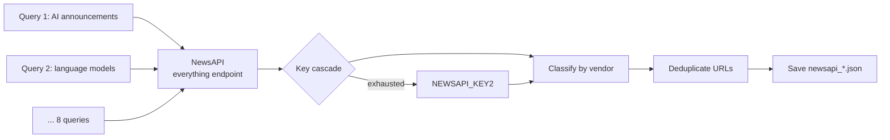

# 11 — Agent: NewsAPI

> **⚠️ RETIRED 2026-05-03.** The NewsAPI agent was dropped from `run_all.py` after an audit found its hits were 100% redundant with Tavily / Perplexity / RSS. The directory `newsapi-agent/` and the linked NotebookLM video remain in the repo for historical reference, but NewsAPI is no longer part of the daily pipeline. See [04 — Collection pattern](./04-collection-pattern.md) for the current 8-agent lineup.

## TL;DR

The NewsAPI agent fires 8 queries through NewsAPI.org's free tier, classifies each article by vendor (using `shared/vendors.py`), deduplicates URLs, and saves the results as supplemental sources for the merger. Like Exa, it's a no-LLM agent — NewsAPI returns clean JSON with structured metadata. Its niche is mainstream wire-service coverage that other agents under-index.

## Why this surface

Mainstream coverage (Reuters, AP, Bloomberg, CNBC, etc.) reaches more readers than vendor blogs and tech press combined, but is harder to find through specialized search APIs. NewsAPI is the one purpose-built source that reliably has this content with clean structured metadata:

- `title`, `url`, `description`, `urlToImage`
- `publishedAt` (always RFC 3339, always reliable)
- `source.name` (named publisher)

For "what is the wider tech press saying about today's AI news," NewsAPI is the cleanest single API.

## Architecture



## Run

```bash
cd newsapi-agent
python3 run.py
```

## Key environment variables

| Var | What it does |
|-----|---------------|
| `NEWSAPI_KEY` | Primary key |
| `NEWSAPI_KEY2` | Backup key |
| `LOOKBACK_DAYS` | Search lookback; default 3 |

## Output

- `newsapi-agent/output/<date>/newsapi_<HHMMSS>.json`

Shape:

```json
{
  "source": "newsapi",
  "briefing": {
    "news_items": [
      {
        "vendor": "OpenAI",
        "headline": "OpenAI announces ...",
        "published_date": "April 27, 2026",
        "summary": "...",
        "urls": ["https://...image=https%3A//..."]
      }
    ]
  }
}
```

## The 8 queries

Hand-tuned. Examples:

- `"AI announcement"`
- `"large language model"`
- `"OpenAI OR Anthropic OR Google AI"`
- `"AI investment OR funding"`
- `"AI safety regulation"`
- `"AI chip OR AI hardware"`
- `"AI agents OR autonomous AI"`
- `"AI startup"`

NewsAPI's syntax supports `AND/OR/NOT` and quoted phrases. The queries are tuned to maximize coverage breadth (not depth — depth is what Tavily and Sonar are for).

## Vendor classification

Each result's `title` + `description` is run against `shared/vendors.py::VENDOR_KEYWORDS` to assign a vendor:

```python
def _classify_vendor(title: str, description: str) -> str:
    text = (title + " " + description).lower()
    for vendor, kws in VENDOR_KEYWORDS.items():
        if any(kw in text for kw in kws):
            return vendor
    return "Other"
```

Same pattern as the RSS agent's `_infer_vendor`. The merger trusts the classification — the URL filter in `publish_data.py` rechecks for cross-vendor leaks (a TechCrunch headline starting with "Google" attached to an Anthropic story).

## Failure modes

### Free tier hit

NewsAPI free tier is **100 requests/day**. With 8 queries, we're well under. But if you crank LOOKBACK_DAYS up or add more queries, you can saturate quickly. The agent rotates to `NEWSAPI_KEY2` on quota errors; both exhausted means the agent writes `news_items: []` and the merger runs without NewsAPI content.

### Both keys exhausted

Same as Exa: thinner merger input but no fatal failure.

### `urlToImage` is broken

Many NewsAPI results have `urlToImage` URLs that 404 or redirect to a generic site logo. `publish_data.py` re-fetches OG images from the actual article page rather than trusting NewsAPI's cached `urlToImage`, so this rarely manifests as a UI bug.

## Code tour

| File | What it does |
|------|---------------|
| `run.py` | Entry point. |
| `newsapi_agent/pipeline.py` | Query list, NewsAPI client calls, key rotation, vendor classification, dedup, output formatting. |

Like Exa, this is a small codebase — the API does the heavy lifting.

## Cool tricks

- **Free tier on auto-pilot.** 8 queries × 30 days = 240 requests/month, well under NewsAPI's 100/day free cap (3000/month). Two keys give 6000/month headroom. Costs $0.
- **`source.name` for publisher attribution.** NewsAPI returns the publisher's display name (e.g., "Reuters", "TechCrunch", "Bloomberg"), which the merger can cite in story bodies. Other search APIs return only domain hostnames.
- **Wide-net query design.** The 8 queries are deliberately broad. NewsAPI charges per request not per result, so a single broad query that returns 100 articles is cheaper than 10 narrow queries that return 10 each.

## Where to go next

- **[12-agent-youtube](./12-agent-youtube.md)** — another no-LLM data source, this one for video.
- **[15-merger](./15-merger.md)** — how the merger uses NewsAPI as supplemental content.
