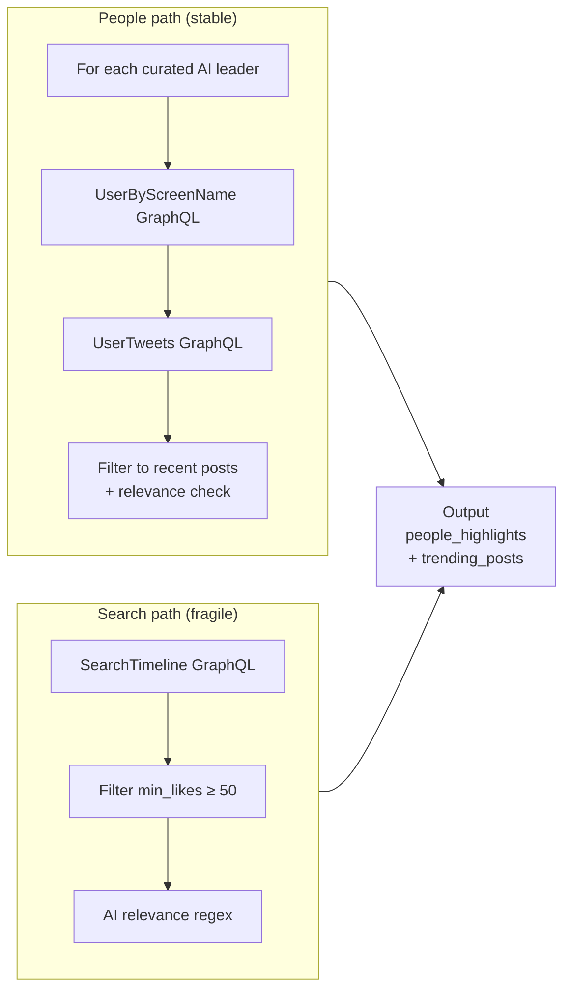

# 14 — Agent: Twitter (X) — $0 cost via cookie scrape

## TL;DR

The Twitter agent pulls posts from X (Twitter) without using any paid API. It calls X's internal GraphQL endpoints with `auth_token` + `ct0` cookies copied from a logged-in browser session. Two paths: the **People timeline** (stable — pulls posts from a curated list of AI leaders) and the **Search/trending** (occasionally breaks when X rotates GraphQL query IDs). It's the active replacement for the disabled paid xAI Grok agent — same output schema, same job, $0/run instead of $0.35/run.

## Why this surface

The X API has gotten progressively worse since 2023:

- The free tier was eliminated (now $100/month for 1500 tweets).
- The Basic tier is $200/month for 10K tweets and limited to read-only.
- The Pro tier is $5000/month for full access.

For a news pipeline that needs to read tweets from ~20 AI leaders + a trending search a few times a day, the API pricing is absurd. The cookie-scrape approach is what's left.

## How cookie scrape works

X.com is a single-page app that calls internal GraphQL endpoints from the browser. Authentication happens via two cookies:

- `auth_token` — long-lived session token (typically 7+ days)
- `ct0` — CSRF token, needed in the `x-csrf-token` header

If you have both cookies from a logged-in session, you can call X's GraphQL endpoints directly with `requests`. Each endpoint expects:

- The right URL (a hash like `https://x.com/i/api/graphql/{query_id}/{operation_name}`)
- Cookies set
- `x-csrf-token` header set to `ct0`
- Various other "browser fingerprint" headers (UA, accept-language, etc.)

X rotates the `query_id` part of the URL periodically (sometimes monthly) — this is what occasionally breaks the search/trending path.

## How to get the cookies

1. Open `x.com` in a logged-in browser.
2. DevTools → Application → Cookies → `https://x.com`.
3. Copy the values of `auth_token` and `ct0`.
4. Paste into env vars:

```bash
TWITTER_AUTH_TOKEN=...
TWITTER_CT0=...
```

Cookies expire when X invalidates the session (re-login, password change, suspicious-activity flag). The agent will start returning empty results — re-grab the cookies.

## Architecture



## Run

```bash
cd twitter-agent
python3 run.py
```

## Key environment variables

| Var | What it does |
|-----|---------------|
| `TWITTER_AUTH_TOKEN` | Session cookie from logged-in x.com |
| `TWITTER_CT0` | CSRF cookie from logged-in x.com |
| `LOOKBACK_DAYS` | How recent posts must be |

## Output

- `twitter-agent/output/<date>/twitter_<HHMMSS>.json`

Shape (matches xAI agent so they're interchangeable):

```json
{
  "source": "twitter",
  "briefing": {
    "people_highlights": [
      {
        "author": "@simonw",
        "name": "Simon Willison",
        "post": "Don't run agents anywhere they might access production credentials...",
        "url": "https://x.com/simonw/status/...",
        "likes": 1398,
        "retweets": 115,
        "vendor": "Anthropic",
        "date": "April 27, 2026"
      }
    ],
    "trending_posts": [
      {"author": "@elonmusk", "post": "...", "likes": 12000, "vendor": "xAI", ...}
    ],
    "community_pulse": "..."
  }
}
```

The merger reads `people_highlights` and `trending_posts` and renders them directly (not through the LLM merge prompt). They appear on the live site as the "Top X posts" and "Trending on X" sections respectively.

## The curated AI leaders list

In `twitter-agent/twitter_agent/pipeline.py::PEOPLE`. Examples:

- `@sama` (Sam Altman)
- `@karpathy` (Andrej Karpathy)
- `@simonw` (Simon Willison)
- `@ylecun` (Yann LeCun)
- `@gdb` (Greg Brockman)
- `@fchollet` (François Chollet)
- `@ethanmollick` (Ethan Mollick)
- `@emollick`, `@emostaque`, `@drjimfan`, `@AnthropicAI`, `@OpenAI`, ...

The list is hand-curated. Adding a person is one line. The agent fetches each person's recent tweets, filters to the last `LOOKBACK_DAYS`, and picks the top 1–2 by engagement (likes + retweets).

## Search/trending fragility

X's search GraphQL endpoint (`SearchTimeline`) has its query_id rotated periodically. When the rotation happens, requests get 404. The fix is to:

1. Open `x.com` and run a search.
2. Open DevTools → Network → filter by `SearchTimeline`.
3. Copy the `query_id` from the URL.
4. Update the constant in `twitter-agent/twitter_agent/pipeline.py`.

History so far: rotation observed twice in 6 months (last 2026-04-27). Both times the people path stayed working — only search broke.

## Schema breakage

X also occasionally restructures the response shape. In April 2026, X moved `screen_name` and `name` from `result.legacy.*` to `result.core.*`. The fix in `_parse_search_tweets`:

```python
# read result.core first, fall back to legacy for older response formats
core = result.get("core", {}) or {}
legacy = result.get("legacy", {}) or {}
screen_name = core.get("screen_name") or legacy.get("screen_name") or "@"
```

The fallback path (`@` as default) is also a tell — if you see authors showing as `@` on the live site, X changed the schema again and this branch fired.

## Filtering tricks

The search path uses `min_faves:N` GraphQL operator to filter low-engagement posts. **Important gotcha:** X silently ignores `min_faves` for some search variants. The agent post-filters with `_TRENDING_MIN_LIKES = 50` to compensate.

The agent also runs an AI-relevance regex (`_AI_RELEVANCE_RE`) over each tweet. Without this filter, a "MODEL RELEASE" search query matches things like "SHANTAE Blender 3D model release" — totally off-topic. The regex requires at least one of: vendor name, common LLM terms (gpt, claude, gemini, llama), or AI-domain words (rag, agent, fine-tune, etc.).

## Failure modes

### Cookies expired

Every API call returns 401. The agent's output is empty (or just `people_highlights: []` and `trending_posts: []`). The fix is to re-grab cookies from a fresh logged-in session and update the env.

### Schema breakage

Tweets show `author: "@"` and broken URLs. The fallback path in `_parse_search_tweets` fired but returned empty. Fix: probe `result.core.user_results.result` paths in DevTools, update the parser.

### query_id rotation

Search/trending returns 404. People timeline still works. Fix: copy fresh query_id from DevTools, update the constant.

### Rate limit

X has internal rate limits even for cookie-authenticated requests. ~50–100 calls per minute is safe. The agent uses ~30 calls per run (people fetch + 1 search), comfortably under.

## Code tour

| File | What it does |
|------|---------------|
| `run.py` | Entry point. |
| `twitter_agent/pipeline.py` | `_fetch_user_tweets`, `_search_recent`, schema parsers, AI-relevance filter, vendor classification. The `_TRENDING_MIN_LIKES` and `_AI_RELEVANCE_RE` constants are tuning knobs. |

## Cool tricks

- **$0 cost via cookie scrape.** Replaces a $0.35/run paid Grok agent with literally zero per-run cost. The trick generalizes to any social platform with browser-based auth.
- **AI-relevance regex.** Cheap way to filter signal-from-noise on a noisy search endpoint. The regex is in source — adjust as language/terminology evolves.
- **Schema fallback chain.** `result.core → result.legacy → '@'` future-proofs the parser against silent schema changes. The `'@'` sentinel is what alerts us to breakage when the live site shows it.
- **Same output schema as xAI agent.** Lets the merger and frontend treat them interchangeably. If the cookie scrape breaks, removing `--skip xai` from the workflow re-enables the paid alternative without code changes.

## Where to go next

- **[15-merger](./15-merger.md)** — how the merger reads Twitter output for the people highlights section.
- **[19-visibility-email](./19-visibility-email.md)** — how the email surfaces "Twitter trending has been empty for 3 days" silent failures.
- **[21-tech-stack-and-tricks](./21-tech-stack-and-tricks.md)** — more cool patterns from the project.
