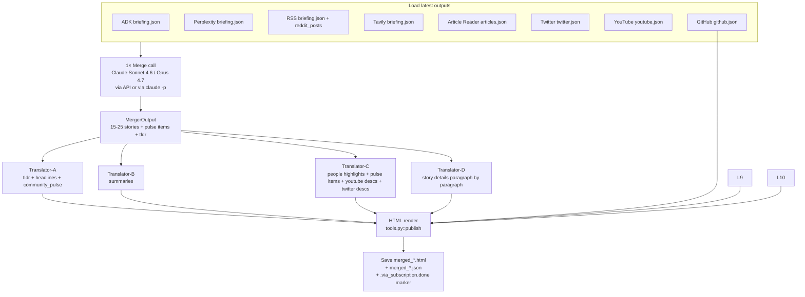

# 15 — Merger Agent

## TL;DR

The Merger is the final agent. It reads every other agent's most recent JSON output, sends them as one large prompt to Claude, gets back a structured `MergerOutput` with 15–25 stories + 5–7 community pulse items + TL;DR bullets. Then it runs **3 parallel Hebrew translation calls** (split by content size to fit within Claude's 32K-token single-turn ceiling), and writes `merged_<HHMMSS>.{html,json}` plus the subscription marker. Total wall-clock: 5–12 minutes per run.

## Why this exists

The 8 collectors produce ~80 raw stories on a typical day, with massive duplication: AWS releases AgentCore → ADK finds 3 articles, Perplexity finds 2, Tavily finds 4, RSS finds the AWS blog — that's potentially 10 separate items about the same announcement. The Merger's job is:

1. **Deduplicate** by topic (cluster the 11 items into one story).
2. **Pick the best 2–4 URLs** per story.
3. **Synthesize** a clean headline + summary + paragraph-level detail.
4. **Rank** by importance.
5. **Write community pulse** items from the social signal (X / Reddit / HN).
6. **Translate** to Hebrew with native quality.
7. **Render** to HTML.

A naive single-LLM approach would give one mushy summary with random URLs. The merger's prompt is structured enough that Claude consistently produces a high-quality merged briefing.

## Architecture



The Merger only **reads** from disk. It never writes intermediate state during execution — everything goes into the final two files (HTML + JSON).

## Run

```bash
# As part of the full pipeline (run_all.py invokes it last):
python3 run_all.py

# Just the merger (collectors stay frozen):
python3 run_all.py --merge-only
```

## Key environment variables

| Var | What it does |
|-----|---------------|
| `ANTHROPIC_API_KEY` | API path |
| `MERGER_VIA_CLAUDE_CODE=1` | Subscription path |
| `MERGER_WRITER_MODEL` | Default `claude-sonnet-4-6` (API path) |
| `MERGER_TRANSLATOR_MODEL` | Default `claude-sonnet-4-6` (API path) |
| `MERGER_CC_MODEL` | Default `claude-opus-4-7` (subscription path) |
| `MERGER_CC_EFFORT` | Default `low` — keeps single-turn output ≤ 32K tokens |

## Output

- `merger-agent/output/<date>/merged_<HHMMSS>.html` — full bilingual newsletter
- `merger-agent/output/<date>/merged_<HHMMSS>.json` — structured output (`briefing`, `briefing_he`)
- `merger-agent/output/<date>/usage_<HHMMSS>.json` — per-call token + cost
- `merger-agent/output/<date>/.via_subscription.done` — marker (only on subscription path)

## The merge prompt structure

`merger-agent/merger_agent/prompts.py` defines `MERGER_SYSTEM_PROMPT`. Highlights:

- **SOURCE A–E mapping.** SOURCE A = ADK, B = Perplexity, C = RSS, D = Tavily News + Perplexity, E = Social (X / Reddit). The prompt explicitly forbids quoting "(per SOURCE X)" in the output — we filter for this in `publish_data.py` to catch fabricated pulse items. (SOURCE F = Exa and SOURCE G = NewsAPI were dropped on 2026-05-03; older merger prompts in git history still reference them.)
- **No URL invention.** The prompt forbids the model from generating URLs not in the source briefings. Layer (b) of the three-layer URL defense.
- **15–25 news_items required.** "Don't compress 50 source stories into 12. A vendor WILL have 2–4 stories if they made multiple announcements."
- **Vendor classification rules.** "Vendor = the COMPANY THE STORY IS ABOUT (the subject/actor), NOT companies mentioned in passing. Specifically: benchmark comparisons name the contender, not the baseline."
- **Community pulse rules.** "5–7 items, REACTIONS not news. Name the platform/person. Source URL must be a forum/social link, NOT a news article."

The prompt is ~200 lines. It's been iterated on heavily — every line is there because of a regression we caught.

## The 4 parallel translators

Why 4 instead of 1? Single-turn Claude responses cap at 32K tokens. The full English briefing has 50K+ tokens of content (TL;DR + 25 headlines + 25 summaries + 25 details + community pulse + people highlights + youtube descs + twitter descs). Splitting into 4 calls keeps each one under 32K and lets them run in parallel.

| Translator | Translates | Output ceiling |
|-----------|-------------|----------------|
| **A — short** | TL;DR (8–10 bullets), headlines (15–25), community_pulse string | ~3K tokens |
| **B — summaries** | News story summaries (one paragraph each) | ~5K tokens |
| **C — people + pulse + descs** | X people highlights, community_pulse_items, YouTube descs, Twitter post descs | ~5K tokens |
| **D — details** | News story details (3–4 paragraphs each) | ~16K tokens — by far the heaviest |

Translator-D is the slowest call (~7 min on Opus). Translators A/B/C all finish in ~1–2 min each.

## Output schema

```python
# merger-agent/merger_agent/schemas.py
class NewsItem(BaseModel):
    vendor: str
    headline: str
    secondary_vendor: str = ""
    published_date: str
    summary: str
    detail: str
    urls: list[str]
    og_image: str = ""

class CommunityPulseItem(BaseModel):
    headline: str
    body: str
    heat: Literal["hot", "warm", "mild"]
    date: str
    source_url: str
    source_label: str
    related_vendor: str = ""
    related_person: str = ""

class MergerOutput(BaseModel):
    tldr: list[str]
    news_items: list[NewsItem]
    community_pulse_items: list[CommunityPulseItem]
    community_pulse: str = ""  # back-compat flat string
    community_urls: list[str] = []
```

The Hebrew counterpart (`HebrewBriefing`) has parallel keys: `tldr_he`, `headlines_he`, `summaries_he`, `details_he`, `community_pulse_he`, `pulse_items_he`, `people_he`, `youtube_descs_he`, `twitter_descs_he`.

## Subscription path

If `MERGER_VIA_CLAUDE_CODE=1` is set, every Anthropic call (the merge call + all 4 translation calls) routes through `shared/anthropic_cc.py::agent`, which shells out to `claude -p` (the Claude Code CLI) with OAuth credentials. Cost per call: $0.

The merger writes the marker file (`.via_subscription.done` with `completed_at` ISO timestamp) when this path was used. CI's first step reads the marker and skips the workflow if it's < 5 hours old.

## URL validation (layer b of 3)

After the merge call returns, `merger-agent/.../pipeline.py` runs:

```python
# whitelist of all URLs that appeared in source briefings
whitelist = {_norm_url(u) for source in sources for item in source.news_items for u in item.urls}

for item in merged.news_items:
    item.urls = [u for u in item.urls if _norm_url(u) in whitelist]
```

This drops any URL the LLM hallucinated that wasn't in the source set. Layer (a) of the URL defense is the prompt instruction; layer (c) is `publish_data.py`'s page-title-keyword check.

## Failure modes

### Sub-32K ceiling exceeded (subscription path)

`claude -p` auto-continues past 32K tokens, which produces multi-message output that breaks the JSON parser. `MERGER_CC_EFFORT=low` keeps output under the ceiling. If you see "Claude Code auto-continued — using first turn only" warnings in the log, the output got close to the ceiling and the agent used the first message only.

### One translator times out

Each translator is independent. If Translator-D times out, the briefing renders without Hebrew details — story summaries and headlines are still translated. Cleaner failure mode than crashing the whole render.

### Source files missing

The merger globs `<agent>/output/<today>/*.json` and silently uses what's available. A missing ADK file means yesterday's ADK is used (or none if there's none to find). Memory: this exact failure was the silent-fallback bug fixed on 2026-04-28 — see [05-agent-adk](./05-agent-adk.md).

## Code tour

| File | What it does |
|------|---------------|
| `merger-agent/run.py` | Entry point; writes the marker on success. |
| `merger-agent/merger_agent/pipeline.py` | `_step1_load`, `_step2_merge`, `_step3_translate` (4 parallel), `_step4_publish`. Implements the URL whitelist filter. |
| `merger-agent/merger_agent/prompts.py` | MERGER_SYSTEM_PROMPT, MERGER_USER_PROMPT, TRANSLATOR_*_PROMPT. |
| `merger-agent/merger_agent/schemas.py` | Pydantic models (`NewsItem`, `CommunityPulseItem`, `MergerOutput`, `HebrewBriefing`). |
| `merger-agent/merger_agent/tools.py` | `publish()` — HTML render with full bilingual layout. |
| `shared/anthropic_cc.py` | Subscription-path wrapper. Used by the merger and the other 3 LLM-using agents. |

## Cool tricks

- **4 parallel translators** sized by content type. Splitting by content type (not random shards) means each translator has a coherent prompt; merging back is trivial because each writes to a unique key.
- **One env var flips API ↔ subscription.** `MERGER_VIA_CLAUDE_CODE=1` and unset `ANTHROPIC_API_KEY`. Same code path, $0 marginal cost. The trick lives in `shared/anthropic_cc.py::is_enabled()`.
- **Marker file + 5-hour skip-window.** Lets local subscription runs and CI cron coexist without double-billing. Implementation is ~30 lines of YAML in the GH Actions workflow.
- **JSON-shaped output schemas via Pydantic.** Forces the LLM to return parseable JSON. The merger's parser uses `output_schema=MergerOutput` (Anthropic's structured output mode); fallback path uses regex to extract JSON from markdown code fences.

## Where to go next

- **[16-publish-pipeline](./16-publish-pipeline.md)** — what `publish_data.py` does after the merger.
- **[20-cost-and-fallbacks](./20-cost-and-fallbacks.md)** — the merger is the most expensive step.
