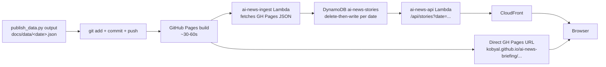

# 17 — Distribution: GitHub Pages + AWS

## TL;DR

The pipeline has two distribution targets. **GitHub Pages** (always) serves `docs/index.html` + `docs/data/<date>.json` as static files. **AWS** (optional, the maintainer's enriched deployment) ingests the GH Pages JSON into DynamoDB via Lambda, then serves the Next.js frontend from S3 + CloudFront with API Gateway routing `/api/*` to a separate query Lambda. Forks can stop at GitHub Pages — that's a complete product.

## Why two targets

GitHub Pages is the **public contract**. Anyone with a GitHub account can fork the repo, run the pipeline, and serve the output for free. No AWS needed.

AWS is the **rich app deployment**. The maintainer's Next.js frontend (in the separate `web/` repo) needs:

- Server-side filtering by date, vendor, search.
- Per-story permalinks (`/story?id=...`) with full data on demand.
- Calendar archive going back months.
- Faster page loads than re-fetching a 2 MB JSON each time.

DynamoDB + API Gateway provide that. CloudFront serves the Next.js static export with low-latency caching.

## Distribution flow



## GitHub Pages — the always-on path

After `local-cycle.sh` runs `git push` (or CI's commit step), GitHub builds Pages from `docs/`. The published URLs:

| URL | What it serves |
|-----|-----------------|
| `kobyal.github.io/ai-news-briefing/` | Redirect to CloudFront (maintainer's preference) |
| `kobyal.github.io/ai-news-briefing/report/latest.html` | Latest merged briefing as standalone HTML |
| `kobyal.github.io/ai-news-briefing/report/<YYYY-MM-DD>.html` | Per-day archive |
| `kobyal.github.io/ai-news-briefing/data/<YYYY-MM-DD>.json` | Daily structured data |
| `kobyal.github.io/ai-news-briefing/data/latest.json` | Latest day's structured data |

For a fork: change the URLs in your fork's CNAME or use `<your-username>.github.io/ai-news-briefing/...`.

GitHub Pages publishing latency is ~30–60 seconds after `git push`. `local-cycle.sh` polls until the new content is served (max 3 min) before invoking the AWS Lambda — otherwise the Lambda might fetch the old content.

## AWS Stack 1 — DatabaseStack (DynamoDB)

Single table: `ai-news-stories`.

Schema:

| Attribute | Type | Purpose |
|-----------|------|---------|
| `pk` | String | Partition key — `STORY#<id>` |
| `sk` | String | Sort key — `DATE#<YYYY-MM-DD>` |
| `date_index` | String | GSI partition key — `<YYYY-MM-DD>` (for "all stories on a date") |
| `vendor_index` | String | GSI partition key — vendor name (for "all stories from vendor") |
| All story fields | (attributes) | headline, summary, detail, vendor, urls[], og_image, ... |

GSIs:

- `DateIndex` (PK = date_index, SK = pk) — supports `?date=YYYY-MM-DD` queries.
- `VendorIndex` (PK = vendor_index, SK = sk) — supports `?vendor=Anthropic` queries.

Lives in `infra/stacks/database_stack.py` (separate repo).

## AWS Stack 2 — TriggerStack (`ai-news-trigger` Lambda)

Purpose: dispatch the GitHub Actions workflow on schedule.

Trigger: EventBridge rule `ai-news-trigger-daily` (cron `0 6 * * *` UTC = 09:00 IL). Currently **disabled** — re-enable with `aws events enable-rule --name ai-news-trigger-daily`.

Action: calls `gh workflow run daily_briefing.yml` with the maintainer's `GH_PAT` token (stored in Secrets Manager).

Lives in `infra/stacks/trigger_stack.py` (separate repo).

## AWS Stack 3 — IngestStack (`ai-news-ingest` Lambda)

Purpose: read today's GH Pages JSON, write it to DynamoDB.

Trigger: EventBridge rule `ai-news-ingest-daily` (cron `30 6 * * *` UTC = 09:30 IL — 30 min after the trigger Lambda fires the workflow). Currently **disabled**.

Also invokable manually:

```bash
aws --profile koby-personal lambda invoke \
  --function-name ai-news-ingest --region us-east-1 \
  --cli-binary-format raw-in-base64-out --payload '{}' \
  /tmp/ingest_response.json
```

Behavior:

1. Fetches `https://kobyal.github.io/ai-news-briefing/data/<today>.json`.
2. Computes story IDs (8-char hash of normalized URL).
3. Queries DynamoDB for existing rows on `date_index = <today>`.
4. Deletes them (so re-running gives a clean state).
5. Writes the new `stories[]`. Each story is one DynamoDB row.

Returns `{"date": "<today>", "deleted": N, "written": N}` — the maintainer's `local-cycle.sh` checks this for errors.

Lives in `infra/stacks/ingest_stack.py` (separate repo). The `2026-04-26 lambda CDK redeploy` was for this Lambda — it now passes `secondary_vendor` through correctly.

## AWS Stack 4 — ApiStack (`ai-news-api` Lambda + API Gateway)

Purpose: serve `/api/*` from DynamoDB.

API routes (proxied by API Gateway):

| Route | Purpose |
|-------|---------|
| `GET /api/stories?date=YYYY-MM-DD` | All stories on a date (uses DateIndex GSI) |
| `GET /api/stories?vendor=Anthropic` | All stories from a vendor (uses VendorIndex GSI) |
| `GET /api/archive` | List of all dates with stories |
| `GET /api/story/:id` | One story by ID |

Returns JSON. CloudFront caches responses with a TTL (default 1 hour, but can be invalidated on demand).

Cache invalidation when re-publishing:

```bash
aws cloudfront create-invalidation \
  --distribution-id E1TSW76SSEILK4 \
  --paths "/api/*"
```

Lives in `infra/stacks/api_stack.py` (separate repo).

## AWS Stack 5 — FrontendStack (S3 + CloudFront + OAC)

Purpose: serve the Next.js static export.

- **S3 bucket** `ai-news-briefing-web` — stores the built `web/out/` directory.
- **CloudFront distribution** `E1TSW76SSEILK4` — global CDN.
- **Origin Access Control (OAC)** — only CloudFront can read S3 (no public bucket).
- **API Gateway integration** — `/api/*` paths route to the API Gateway.

Deploy from `web/`:

```bash
cd web
npm run build
aws s3 sync out s3://ai-news-briefing-web --delete --exclude "data/*"
aws cloudfront create-invalidation --distribution-id E1TSW76SSEILK4 --paths "/*"
```

The `--exclude "data/*"` is critical. The `data/` folder in S3 is written by the ingest Lambda (mirror of DynamoDB JSON for direct CloudFront access). Without the exclude, `--delete` would wipe it.

Lives in `infra/stacks/frontend_stack.py` (separate repo).

## EventBridge — currently disabled

Both rules (`ai-news-trigger-daily` and `ai-news-ingest-daily`) have been disabled since 2026-04-26 to avoid double-runs while the maintainer was iterating locally. Re-enable:

```bash
aws --profile koby-personal events enable-rule --name ai-news-trigger-daily --region us-east-1
aws --profile koby-personal events enable-rule --name ai-news-ingest-daily --region us-east-1
```

The marker file mechanism (see [03-trigger-and-runtime](./03-trigger-and-runtime.md)) means re-enabling won't double-run on days the maintainer ran locally.

## For a fork — what to skip

If you fork without AWS:

| Component | Replacement |
|-----------|-------------|
| `ai-news-trigger` Lambda | GitHub Actions cron (uncomment the cron block in `daily_briefing.yml`). |
| `ai-news-ingest` Lambda | Skip — your fork's frontend reads `docs/data/<date>.json` directly. |
| DynamoDB | Skip — the JSON is your source of truth. |
| `ai-news-api` Lambda + API Gateway | Skip — serve JSON directly. |
| S3 + CloudFront frontend | Skip — GitHub Pages serves `docs/index.html` for free. |

You lose: per-story permalinks, server-side filtering, calendar archive UI. You keep: a complete daily briefing accessible from a public URL.

## Code tour

| File | What it does |
|------|---------------|
| `infra/app.py` (separate repo) | CDK app entry point. |
| `infra/stacks/database_stack.py` | DynamoDB table + GSIs. |
| `infra/stacks/trigger_stack.py` | EventBridge rule + dispatch Lambda. |
| `infra/stacks/ingest_stack.py` | Ingest Lambda (Python handler in `infra/lambdas/ingest/`). |
| `infra/stacks/api_stack.py` | Query Lambda + API Gateway. |
| `infra/stacks/frontend_stack.py` | S3 bucket + CloudFront + OAC. |

## Cool tricks

- **GH Pages as the source of truth.** The ingest Lambda doesn't read from S3 or any other AWS service — it pulls from `kobyal.github.io`. This makes the pipeline portable: if AWS goes away, GH Pages still works.
- **Delete-then-write per date.** Re-running the ingest is idempotent. No "did I write this twice?" anxiety.
- **API Gateway routes `/api/*` to the API Lambda; everything else falls through to S3.** Single CloudFront distribution serves both the static site and the API.
- **5 stacks for 5 concerns.** Database / Trigger / Ingest / Api / Frontend. Clean separation; each is independently deployable.

## Where to go next

- **[18-website-frontend](./18-website-frontend.md)** — what the Next.js app does with the data.
- **[19-visibility-email](./19-visibility-email.md)** — how AWS health surfaces in the email.
