# 18 — Website / frontend

## TL;DR

The frontend is a **Next.js 14 static-export app** that lives in a separate gitignored repo (`web/`). It deploys to S3 + CloudFront and reads the daily briefing JSON either directly from `docs/data/<date>.json` (build time) or via the `/api/*` proxy at runtime. Routes: home, per-day, calendar archive, story detail, community (X + Reddit), media (YouTube videos + curated channels + podcasts), GitHub. For a fork, `web/` is one example consumer of the public JSON contract — write your own if you don't want Next.js.

## Why Next.js static export

Three reasons:

1. **Free hosting.** Static-export means no server. S3 + CloudFront → near-zero hosting cost.
2. **SEO.** Server-rendered HTML for every page (date, story, vendor) means Google indexes the content directly.
3. **Bilingual rendering.** Next.js's component model handles the EN/HE toggle cleanly; one component, two language modes.

The tradeoff: pages are pre-rendered at build time. Dynamic data (today's stories, calendar of past dates) needs the `/api/*` proxy or a build trigger when new data arrives.

## Routes

```
/                          Homepage — TL;DR, story grid, vendor filter, community
/[date]                    Per-day briefing (e.g., /2026-04-28)
/story?id=<id>             Individual story permalink
/community/                X people highlights + trending + Reddit
/media/                    YouTube videos + curated channels + podcasts
/github/                   GitHub trending + tracked releases
/archive/                  Calendar of past briefings
/about/                    Project info + how it's built
```

## Data flow

```mermaid
flowchart LR
    subgraph build["Build time"]
        B1[next build]
        B2[fetch /api/archive<br/>fetch /api/stories?date=...]
        B3[Pre-render pages]
        B1 --> B2 --> B3
    end

    subgraph runtime["Runtime"]
        R1[User loads /]
        R2[Static HTML served from S3]
        R3[Hydration loads recent dates list]
        R4[Client navigates to /2026-04-28]
        R5[Static HTML served from S3]
        R1 --> R2 --> R3 --> R4 --> R5
    end

    subgraph dynamic["Dynamic data (when needed)"]
        D1[fetch &#040;/api/stories?date=...&#041;]
        D2[API Gateway → ai-news-api Lambda]
        D3[DynamoDB query]
    end

    R3 -.optional dynamic refresh.-> D1
    D1 --> D2 --> D3
```



The most common pattern: pages are pre-rendered with the build's snapshot of data; dynamic refreshes (e.g., the home page polling for "today" if it's after sunset and the day rolled over) hit `/api/*` for fresh data.

## Components

Key reusable components (under `web/src/components/`):

- **`StoryCard`** — vendor badge, headline, summary, source URLs, OG image, language toggle.
- **`VendorFilterBar`** — filter chips for the 14 vendors + Other.
- **`TLDR`** — top-of-page bullet list.
- **`CommunitySection`** — X people highlights + trending + Reddit cards.
- **`MediaSection`** — YouTube grid + recommended channels + podcasts.
- **`Header`** — the orange-amber header with language toggle.
- **`Footer`** — repo links, attribution.

The story card has both EN and HE versions of every field; the toggle reveals one or the other without re-fetching.

## How the data is loaded

`fetchDayData(date)` is the canonical loader. Three modes:

```typescript
async function fetchDayData(date: string) {
  // 1. CloudFront API (lowest latency, freshest data)
  try { return await fetch(`/api/stories?date=${date}`).json() } catch {}

  // 2. CloudFront direct JSON (built into S3 by the build)
  try { return await fetch(`/data/${date}.json`).json() } catch {}

  // 3. GitHub Pages JSON (last-resort fallback)
  return await fetch(`https://kobyal.github.io/ai-news-briefing/data/${date}.json`).json()
}
```

The cascade matters: if the AWS API is degraded (rare), the site still renders from the static S3 mirror or GH Pages. Three independent paths, one code call.

## The shape mismatch caveat

There are TWO JSON shapes in flight:

1. **`docs/data/<date>.json`** (from `publish_data.py`):
   ```json
   { "date": "...", "briefing": {...}, "twitter": {...}, "youtube": [...], "github": [...] }
   ```

2. **`/api/stories?date=...`** (from the API Lambda → DynamoDB):
   ```json
   { "date": "...", "stories": [...], "tldr": [...] }
   ```

The frontend's `fetchDayData` knows both shapes and normalizes.

History: the 2026-04-26 incident — `local-cycle.sh` had a `[6c]` step that re-uploaded `docs/data/<date>.json` directly to S3 to fix a different bug. This overwrote the API-shape JSON in S3 with the publish-shape JSON, and the frontend's `fetchDayData` couldn't read the wrong shape → live site showed empty stories. The fix was to remove `[6c]` after the lambda CDK was patched to handle the missing field directly. Memory of this is in `private/LOCAL_RUN.md`.

Takeaway: when forking, document which JSON shape your frontend expects, and don't conflate "data we publish" with "data we serve."

## Local dev

```bash
cd web
npm install
npm run dev   # → http://localhost:3000
```

The dev server proxies `/api/*` to the production CloudFront, so `npm run dev` shows live data from today.

## Build & deploy

```bash
cd web
npm run build                          # → web/out/ (static export)
aws s3 sync out s3://ai-news-briefing-web --delete --exclude "data/*"
aws cloudfront create-invalidation --distribution-id E1TSW76SSEILK4 --paths "/*"
```

The `--exclude "data/*"` is mandatory. The S3 `data/` folder is written by the ingest Lambda (a mirror of DynamoDB for direct CloudFront access). Without the exclude, `--delete` would wipe the live data.

## Why `web/` is gitignored

The maintainer's `web/` is a separate git repo with no remote — commits stay local, deploys go directly to S3. Three reasons:

1. **Iteration speed.** The frontend changes far more often than the pipeline. Pushing every CSS tweak as a public commit on `ai-news-briefing` would noise up the repo.
2. **Different audience.** Forkers might want to write their own frontend (in Astro, SvelteKit, plain HTML). `web/` being in the public repo would imply the Next.js app is part of the contract.
3. **Privacy.** The maintainer's deployment has some layout preferences specific to them. Splitting them out keeps the public repo's surface clean.

For a fork: build your own consumer that reads `docs/data/<date>.json`. The schema is documented in [00-overview](./00-overview.md) and stable.

## Common gotchas

- **`VendorFilterBar` `vendors` prop.** Both `BriefingPage.tsx` and `HomePage.tsx` use the component. Both must pass `vendors={...}` (the list from today's data) — easy to miss when adding it to a new page.
- **`favicon.ico` overrides `icon.svg`.** Next.js auto-discovers any `favicon.ico` in `app/` and serves it. The intended icon is `icon.svg` (amber gradient). If a `favicon.ico` accidentally lands in `app/`, delete it.
- **Reddit section style** — title as plain text (not a link), `💬 N comments` engagement pill, `View thread →` small link bottom-right. No Hebrew. Maintainer preference; documented in feedback memory.
- **Header → 2-line logo** — must align cleanly on mobile and desktop. Don't rewrite from scratch — make targeted edits.

## Cool tricks

- **3-fallback `fetchDayData`.** API → S3 mirror → GH Pages. Three independent paths means the site keeps working even if 2 are down.
- **JSON shape indirection.** The frontend doesn't care if data comes from publish_data.py or DynamoDB — `fetchDayData` normalizes. Lets the backend evolve without breaking the frontend.
- **Static export with dynamic refresh.** Best of both worlds — fast first paint via S3, fresh data on demand via `/api/*`.

## Where to go next

- **[17-distribution-aws](./17-distribution-aws.md)** — the AWS layer this frontend talks to.
- **[22-fork-guide](./22-fork-guide.md)** — how to swap the frontend for your own.
